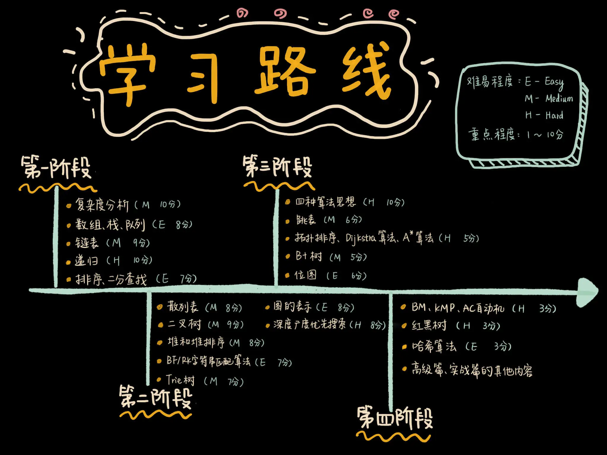

# 算法掌握自测

---

# 实际开发中如何灵活运用数据结构与算法

学习数据结构和算法，不要停留在学院派的思维中，只把算法当作应付面试、考试或者竞赛的花拳绣腿。作为软件开发工程师，我们要把数据结构和算法，应用到软件开发中，解决实际的开发问题。

不过，要想在实际的开发中，灵活、恰到好处地应用数据结构和算法，需要非常深厚的实战经验积累。尽管我在课程中，一直都结合实际的开发场景来讲解，希望带你真枪实弹地演练算法如何解决实际的问题。但是，在今后的软件开发中，你要面对的问题远比我讲的场景要复杂、多变、不确定。

要想游刃有余地解决今后你要面对的问题，光是熟知每种数据结构和算法的功能、特点、时间空间复杂度，还是不够的。毕竟工程上的问题不是算法题。算法题的背景、条件、限制都非常明确，我们只需要在规定的输入、输出下，找最优解就可以了

而工程上的问题往往都比较开放，在选择数据结构和算法的时候，我们往往需要综合各种因素，比如编码难度、维护成本、数据特征、数据规模等，最终选择一个
**工程的最合适解**，而非**理论上的最优解。**

为了让你能做到活学活用，在实际的软件开发中，不生搬硬套数据结构和算法，今天，我们就聊一聊，在实际的软件开发中，如何权衡各种因素，合理地选择使用哪种数据结构和算法？关于这个问题，可以参考下面六条经验。

## 1. 时间、空间复杂度不能跟性能划等号

我们在学习每种数据结构和算法的时候，都详细分析了算法的时间复杂度、空间复杂度，但是，在实际的软件开发中，复杂度不能与性能简单划等号，不能表示执行时间和内存消耗的确切数据量。为什么这么说呢？原因有下面几点。

### 复杂度不是执行时间和内存消耗的精确值

在用大 O 表示法表示复杂度的时候，我们会忽略掉低阶、常数、系数，只保留高阶，并且它的度量单位是语句的执行频度。每条语句的执行时间，并非是相同、确定的。所以，复杂度给出的只能是一个非精确量值的趋势。

### 代码的执行时间有时不跟时间复杂度成正比

我们常说，时间复杂度是 O(nlogn) 的算法，比时间复杂度是 O(n^2)
的算法，执行效率要高。这样说的一个前提是，算法处理的是大规模数据的情况。对于小规模数据的处理，算法的执行效率并不一定跟时间复杂度成正比，有时还会跟复杂度成反比。

### 对于处理不同问题的不同算法，其复杂度大小没有可比性

复杂度只能用来表征不同算法，在处理同样的问题，以及同样数据类型的情况下的性能表现。但是，对于不同的问题、不同的数据类型，不同算法之间的复杂度大小并没有可比性。

## 2. 抛开数据规模谈数据结构和算法都是“耍流氓”

在平时的开发中，在数据规模很小的情况下，普通算法和高级算法之间的性能差距会非常小。如果代码执行频率不高、又不是核心代码，这个时候，我们选择数据结构和算法的主要依据是，其是否简单、容易维护、容易实现。大部分情况下，我们直接用最简单的存储结构和最暴力的算法就可以了

比如，对于长度在一百以内的字符串匹配，我们直接使用朴素的字符串匹配算法就够了。如果用 KMP、BM
这些更加高效的字符串匹配算法，实际上就大材小用了。因为这对于处理时间是毫秒量级敏感的系统来说，性能的提升并不大。相反，这些高级算法会徒增编码的难度，还容易产生
bug

## 3. 结合数据特征和访问方式来选择数据结构

面对实际的软件开发场景，当我们掌握了基础数据结构和算法之后，最考验能力的并不是数据结构和算法本身，
而是**对问题需求的挖掘、抽象、建模。如何将一个背景复杂、开放的问题，通过细致的观察、调研、假设，理清楚要处理数据的特征与访问方式，这才是解决问题的重点。
**
只有理清楚了这些东西，我们才能将问题转化成合理的数据结构模型，进而找到满足需求的算法。

数据结构的选择应基于数据特征和访问方式进行优化，举个例子：

1. **Trie 树适用场景**：适用于前缀高度重合的小字符集数据。如果前缀重合度低且字符集大，Trie 树的存储和查询效率可能不理想。
2. **图的存储方式选择**：

- **邻接表**：适用于稀疏图（边较少），节省空间，查询特定节点的邻居较高效。
- **邻接矩阵**：适用于稠密图（边较多），快速判断两点是否相连，但存储空间较大。

3. **数据分析的重要性**：在使用特定数据结构前，需对数据特征进行分析（如编写测试代码），以确保选用最优的数据表示方式，提高存储和查询效率。

## 4. 区别对待 IO 密集、内存密集和计算密集

代码性能优化的关键在于识别瓶颈，并针对不同存储环境采取相应策略：

1. **磁盘存储（数据库）场景**：

- **主要瓶颈：磁盘 IO**，应减少数据库查询次数。
- **优化策略**：
    - **预计算**：对于稳定的数据（如最终推荐人），可离线计算并存储，避免频繁查询。
    - **批量查询**：减少单次查询次数，提高数据库访问效率。
    - **索引优化**：合理建立索引，加速查询。

2. **内存存储场景**：

- **CPU 密集型**（计算复杂度高，主要消耗 CPU 资源）：
    - **优化策略**：减少计算复杂度，如使用位运算优化加减乘除。
- **内存密集型**（数据存取频繁，主要受内存访问速度限制）：
    - **优化策略**：
        - **减少数据读取量**，避免不必要的访问。
        - **保证数据的连续存储**，利用 CPU 缓存预读，提高访问效率。

**核心思路**：针对不同瓶颈（磁盘 IO、CPU 计算、内存访问），选择合适的数据结构和优化策略，以提升程序整体性能。

## 5. 善用语言提供的类，避免重复造轮子

1. **优先使用语言提供的标准实现**：

- Java 的 `HashMap`（哈希表）、`TreeMap`（红黑树）等都是经过充分验证的，正确性和鲁棒性优于自定义实现。
- 直接使用标准库可以提高开发效率，减少维护成本。

2. **避免不必要的“造轮子”**：

- 自己实现数据结构和算法需要大量测试，考虑各种异常情况，且团队需要理解和维护，成本较高。
- 只有在标准库不能满足特殊需求时，才考虑自定义实现。

3. **学习数据结构和算法的核心价值**：

- **深入理解原理**，能更好地应用现有工具，提高代码质量和性能。
- **区分普通开发者与技术专家**，掌握底层原理是提升编程能力的关键。

**总结**：工程实践中，优先使用成熟的标准库，避免重复造轮子。但深入理解数据结构与算法的原理，能帮助更高效地使用这些工具，提高编程能力和系统设计水平。

## 6. 千万不要漫无目的地过度优化

1. **避免过度优化**：

- 对于微小的性能提升（如从 0.01 秒优化到 0.005 秒），如果不是在一个性能关键的场景下，这种优化带来的好处可能微不足道。过度优化会增加代码复杂度和维护成本，得不偿失。

2. **学会估算**：

- 在开发过程中，估算数据规模和性能需求是关键。你需要考虑：
    - **正常情况下的数据规模**。
    - **异常情况下的压力**，如高并发或大数据量。
    - **未来可能面临的增长**，以便提前做好准备。
- 只有通过合理的估算，才能确保代码在长期运行中能够有效地应对不断变化的需求。

3. **Benchmark 基准测试**：

- 在进行优化前，先做基准测试（Benchmark）。这可以帮助你了解当前实现的性能，并确认优化是否真正有效。换用新的算法或数据结构时，可能会导致意外的性能下降，因此实际测试很重要。

**总结**：数据结构和算法优化应当基于实际的性能需求，而不是盲目追求微小的提升。在优化时，要做充分的估算和基准测试，确保优化能够带来实际的效果，避免因优化过度而增加维护成本。