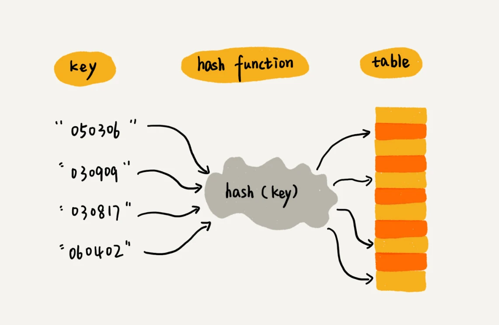
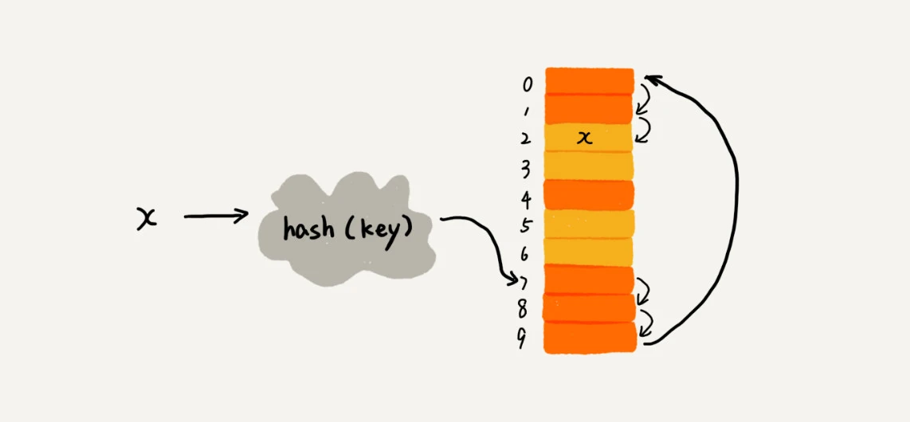
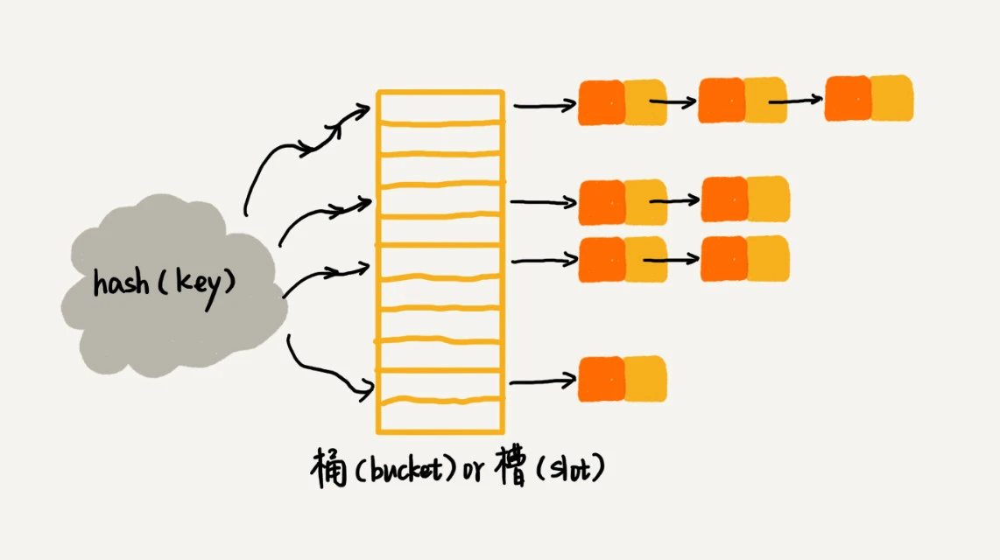

# 散列表

**概念**:
散列表用的是数组支持按照下标随机访问数据的特性，所以散列表其实就是数组的一种扩展，由数组演化而来。可以说，如果没有数组，就没有散列表



我们可以总结出这样的规律：散列表用的就是数组支持按照下标随机访问的时候，时间复杂度是 O(1)
的特性。我们通过散列函数把元素的键值映射为下标，然后将数据存储在数组中对应下标的位置。当我们按照键值查询元素时，我们用同样的散列函数，将键值转化数组下标，从对应的数组下标的位置取数据。

**散列函数设计的基本要求:**

1. 散列函数计算得到的散列值是一个非负整数
2. 如果 key1 = key2，那 hash(key1) == hash(key2)；
3. 如果 key1 ≠ key2，那 hash(key1) ≠ hash(key2)。

解释一下这三点。其中，第一点理解起来应该没有任何问题。因为数组下标是从 0 开始的，所以散列函数生成的散列值也要是非负整数。第二点也很好理解。相同的
key，经过散列函数得到的散列值也应该是相同的。

第三点理解起来可能会有问题，我着重说一下。这个要求看起来合情合理，但是在真实的情况下，要想找到一个不同的 key
对应的散列值都不一样的散列函数，几乎是不可能的。即便像业界著名的MD5、SHA、CRC等哈希算法，也无法完全避免这种散列冲突。而且，因为数组的存储空间有限，也会加大散列冲突的概率

## 散列冲突

### 1. 开放寻址法

开放寻址法的核心思想是，如果出现了散列冲突，我们就重新探测一个空闲位置，将其插入。那如何重新探测新的位置呢？我先讲一个比较简单的探测方法，线性探测（Linear
Probing）。

当我们往散列表中插入数据时，如果某个数据经过散列函数散列之后，存储位置已经被占用了，我们就从当前位置开始，依次往后查找，看是否有空闲位置，直到找到为止。



对于开放寻址冲突解决方法，除了线性探测方法之外，还有另外两种比较经典的探测方法，二次探测（Quadratic probing）和双重散列（Double
hashing）。

所谓二次探测，跟线性探测很像，线性探测每次探测的步长是 1，那它探测的下标序列就是 hash(key)+0，hash(key)+1，hash(key)
+2……而二次探测探测的步长就变成了原来的“二次方”，也就是说，它探测的下标序列就是 hash(key)+0，hash(key)+12，hash(key)
+22……

所谓双重散列，意思就是不仅要使用一个散列函数。我们使用一组散列函数 hash1(key)，hash2(key)，hash3(key)
……我们先用第一个散列函数，如果计算得到的存储位置已经被占用，再用第二个散列函数，依次类推，直到找到空闲的存储位置。

不管采用哪种探测方法，当散列表中空闲位置不多的时候，散列冲突的概率就会大大提高。为了尽可能保证散列表的操作效率，一般情况下，我们会尽可能保证散列表中有一定比例的空闲槽位。我们用装载因子（load
factor）来表示空位的多少

```text
散列表的装载因子=填入表中的元素个数/散列表的长度
```

装载因子越大，说明空闲位置越少，冲突越多，散列表的性能会下降

### 2. 链表法

链表法是一种更加常用的散列冲突解决办法，相比开放寻址法，它要简单很多。我们来看这个图，在散列表中，每个“桶（bucket）”或者“槽（slot）”会对应一条链表，所有
散列值相同的元素我们都放到相同槽位对应的链表中



## 设计一个工业级别的散列表

如何设计一个可以应对各种异常情况的工业级散列表，来避免在散列冲突的情况下，散列表性能的急剧下降，并且能抵抗散列碰撞攻击？

### 散列函数的设计

### 装载因子的动态调整

### 如何避免低效的扩容

### 如何选择冲突解决方案

##### 思考题

课后思考今天讲的几个散列表和链表结合使用的例子里，我们用的都是双向链表。如果把双向链表改成单链表，还能否正常工作呢？为什么呢？

假设猎聘网有 10 万名猎头，每个猎头都可以通过做任务（比如发布职位）来积累积分，然后通过积分来下载简历。假设你是猎聘网的一名工程师，如何在内存中存储这
10 万个猎头 ID 和积分信息，让它能够支持这样几个操作：

1. 根据猎头的 ID 快速查找、删除、更新这个猎头的积分信息；
2. 查找积分在某个区间的猎头 ID 列表；
3. 查找按照积分从小到大排名在第 x 位到第 y 位之间的猎头 ID 列表。