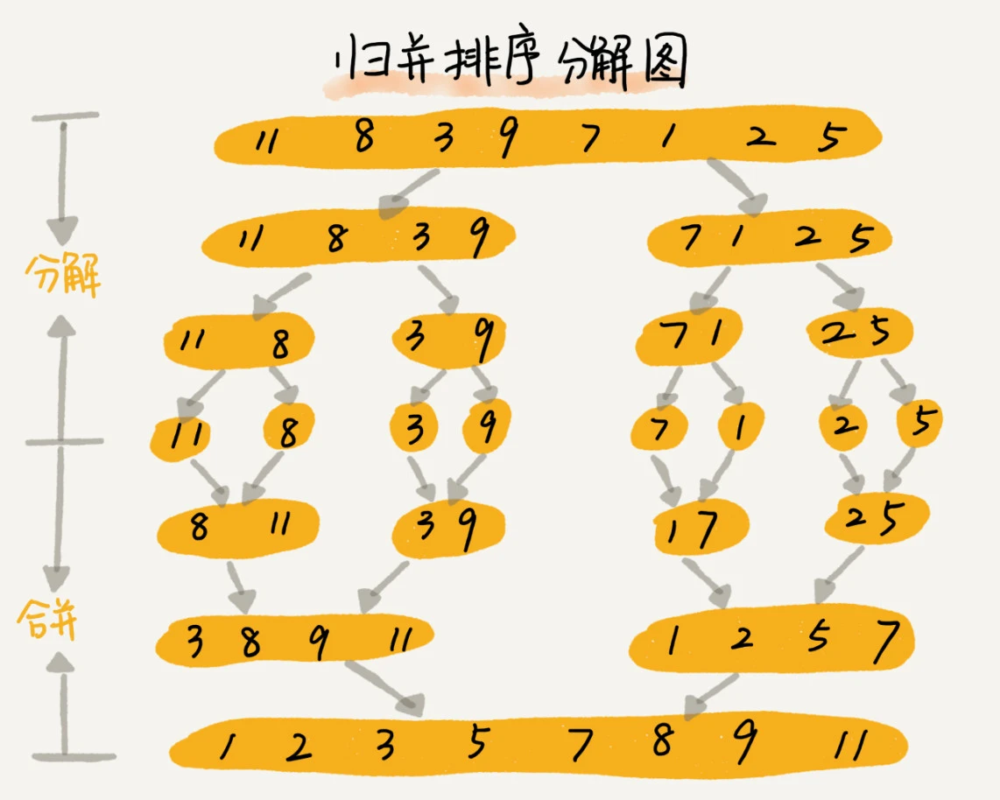

## 10大常见排序算法的介绍

| 排序算法      | 时间复杂度（最坏） | 时间复杂度（平均） | 空间复杂度 | 稳定性 |
|---------------|--------------------|--------------------|------------|--------|
| 冒泡排序      | \(O(n^2)\)         | \(O(n^2)\)         | \(O(1)\)   | 稳定   |
| 选择排序      | \(O(n^2)\)         | \(O(n^2)\)         | \(O(1)\)   | 不稳定 |
| 插入排序      | \(O(n^2)\)         | \(O(n^2)\)         | \(O(1)\)   | 稳定   |
| 快速排序      | \(O(n^2)\)         | \(O(n \log n)\)    | \(O(\log n)\) | 不稳定 |
| 归并排序      | \(O(n \log n)\)    | \(O(n \log n)\)    | \(O(n)\)   | 稳定   |
| 堆排序        | \(O(n \log n)\)    | \(O(n \log n)\)    | \(O(1)\)   | 不稳定 |
| 希尔排序      | \(O(n^2)\)         | \(O(n \log n)\)    | \(O(1)\)   | 不稳定 |
| 计数排序      | \(O(n + k)\)       | \(O(n + k)\)       | \(O(n + k)\) | 稳定   |
| 基数排序      | \(O(d \times (n + k))\) | \(O(d \times (n + k))\) | \(O(n + k)\) | 稳定   |
| 桶排序        | \(O(n^2)\)         | \(O(n + k)\)       | \(O(n + k)\) | 依赖桶内排序 |


## 排序算法的执行效率

对于排序算法的执行效率，我们一般通过以下几个方面来衡量

1. 最好情况、最坏情况、平均情况时间复杂度
2. 时间复杂度的系数、常数、低阶
3. 比较次数和交换次数

## 排序算法的内存消耗


我们前面讲过，算法的内存消耗可以通过空间复杂度来衡量，排序算法也不例外。不过，针对排序算法的空间复杂度，我们还引入了一个新的概念，原地排序（Sorted in place）。原地排序算法，就是特指空间复杂度是 O(1) 的排序算法。冒泡、插入、选择排序，都是原地排序算法。

## 排序算法的稳定性

稳定性。这个概念是说，如果待排序的序列中存在值相等的元素，经过排序之后，相等元素之间原有的先后顺序不变。

---

# 冒泡排序

冒泡排序只会操作相邻的两个数据。每次冒泡操作都会对相邻的两个元素进行比较，看是否满足大小关系要求。如果不满足就让它俩互换。一次冒泡会让至少一个元素移动到它应该在的位置，重复 n 次，就完成了 n 个数据的排序工作


插入排序的不稳定性解释

比如 5，8，5，2，9 这样一组数据，使用选择排序算法来排序的话，第一次找到最小元素 2，与第一个 5 交换位置，那第一个 5 和中间的 5 顺序就变了，所以就不稳定了。正是因此，相对于冒泡排序和插入排序，选择排序就稍微逊色了


## 归并排序


### 归并排序的性能分析

#### 第一，归并排序是稳定的排序算法吗？

结合下图画的归并排序，你应该能发现，归并排序稳不稳定关键要看 merge() 函数，也就是两个有序子数组合并成一个有序数组的那部分代码。在合并的过程中，如果 A[p...q]和 A[q+1...r]之间有值相同的元素，那我们可以像伪代码中那样，先把 A[p...q]中的元素放入 tmp 数组。这样就保证了值相同的元素，在合并前后的先后顺序不变。所以，归并排序是一个稳定的排序算法。


#### 第二，归并排序的时间复杂度是多少？

归并排序涉及递归，时间复杂度的分析稍微有点复杂。我们正好借此机会来学习一下，如何分析递归代码的时间复杂度。在递归那一节我们讲过，递归的适用场景是，一个问题 a 可以分解为多个子问题 b、c，那求解问题 a 就可以分解为求解问题 b、c。问题 b、c 解决之后，我们再把 b、c 的结果合并成 a 的结果。如果我们定义求解问题 a 的时间是 T(a)，求解问题 b、c 的时间分别是 T(b) 和 T( c)，那我们就可以得到这样的递推关系式：
```text
T(a) = T(b) + T(c) + K
```
其中 K 等于将两个子问题 b、c 的结果合并成问题 a 的结果所消耗的时间。

从刚刚的分析，我们可以得到一个重要的结论：不仅递归求解的问题可以写成递推公式，递归代码的时间复杂度也可以写成递推公式。

我们假设对 n 个元素进行归并排序需要的时间是 T(n)，那分解成两个子数组排序的时间都是 T(n/2)。我们知道，merge() 函数合并两个有序子数组的时间复杂度是 O(n)。所以，套用前面的公式，归并排序的时间复杂度的计算公式就是：
```text
T(1) = C；   n=1时，只需要常量级的执行时间，所以表示为C。
T(n) = 2*T(n/2) + n； n>1
```
通过这个公式，如何来求解 T(n) 呢？还不够直观？那我们再进一步分解一下计算过程。

```text
T(n) = 2*T(n/2) + n
     = 2*(2*T(n/4) + n/2) + n = 4*T(n/4) + 2*n
     = 4*(2*T(n/8) + n/4) + 2*n = 8*T(n/8) + 3*n
     = 8*(2*T(n/16) + n/8) + 3*n = 16*T(n/16) + 4*n
     ......
     = 2^k * T(n/2^k) + k * n
     ......
```

通过这样一步一步分解推导，我们可以得到 T(n) = 2^kT(n/2^k)+kn。当 T(n/2^k)=T(1) 时，也就是 n/2^k=1，我们得到 k=log2n 。我们将 k 值代入上面的公式，得到 T(n)=Cn+nlog2n 。如果我们用大 O 标记法来表示的话，T(n) 就等于 O(nlogn)。所以归并排序的时间复杂度是 O(nlogn)。

从我们的原理分析和伪代码可以看出，归并排序的执行效率与要排序的原始数组的有序程度无关，所以其时间复杂度是非常稳定的，不管是最好情况、最坏情况，还是平均情况，时间复杂度都是 O(nlogn)。

#### 归并排序的空间复杂度

实际上，递归代码的空间复杂度并不能像时间复杂度那样累加，尽管每次合并操作都需要申请额外的内存空间，但在合并完成之后，临时开辟的内存空间就被释放掉了。在任意时刻，CPU 只会有一个函数在执行，也就只会有一个临时的内存空间在使用。临时内存空间最大也不会超过 n 个数据的大小，所以空间复杂度是 O(n)。

```go
// merge 使用哨兵值优化
func merge(left []int, right []int) []int {
	// 在 left 和 right 的末尾添加一个正无穷大值
	left = append(left, math.MaxInt64)
	right = append(right, math.MaxInt64)

	result := make([]int, 0, len(left)+len(right)-2) // 初始化结果切片
	i, j := 0, 0                                     // 指向 left 和 right 的索引

	for k := 0; k < len(left)+len(right)-2; k++ { // 总元素数 = 原数组长度的和
		if left[i] <= right[j] {
			result = append(result, left[i])
			i++
		} else {
			result = append(result, right[j])
			j++
		}
	}

	return result
}
```

**归并排序与快速排序的实现对比**


可以发现，归并排序的处理过程是由下到上的，先处理子问题，然后再合并。而快排正好相反，它的处理过程是由上到下的，先分区，然后再处理子问题。归并排序虽然是稳定的、时间复杂度为 O(nlogn) 的排序算法，但是它是非原地排序算法。我们前面讲过，归并之所以是非原地排序算法，主要原因是合并函数无法在原地执行。快速排序通过设计巧妙的原地分区函数，可以实现原地排序，解决了归并排序占用太多内存的问题。