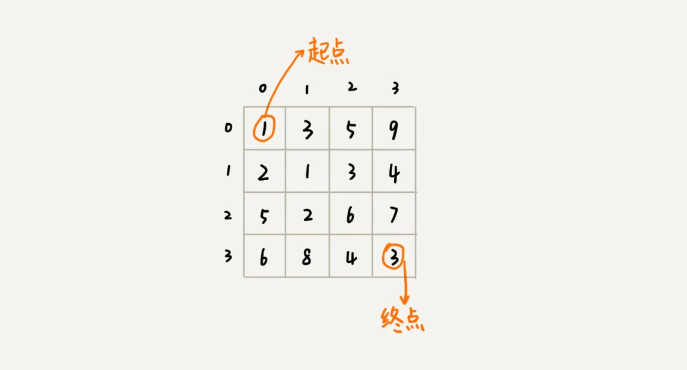
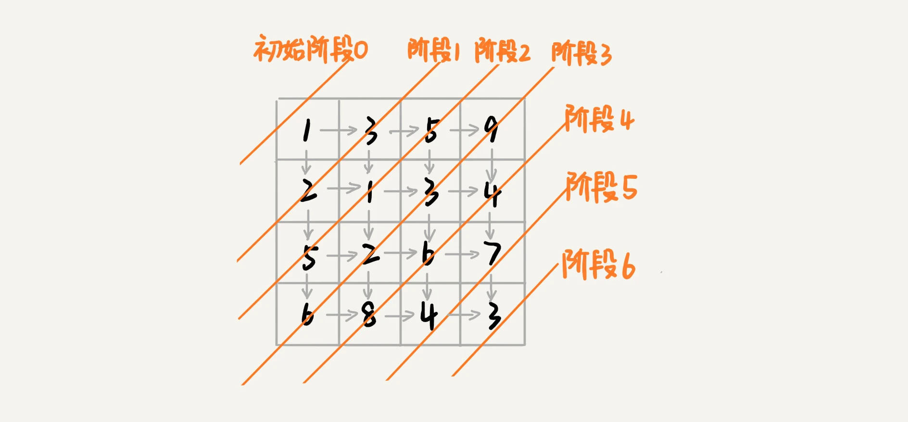
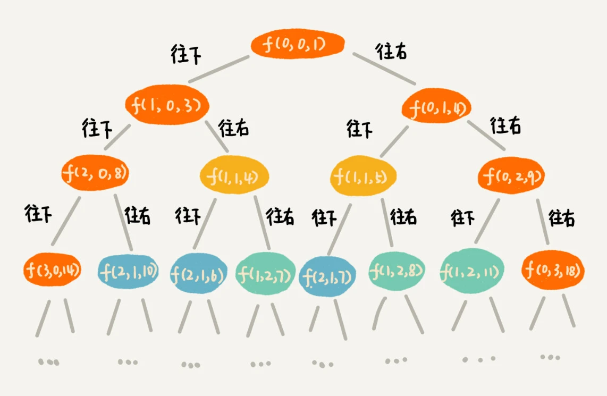

# 动态规划

## 动态规划的初步认识

### 动态规划的定义

动态规划（英语：Dynamic programming，简称DP）是一种在数学、管理学、计算机科学、经济学和生物信息学中经常使用的通过将原问题分解成相对简单的子问题的方式求解复杂问题的方法。

通常许多子问题非常相似，为此动态规划法试图仅仅解决每个子问题一次，从而减少计算量：一旦某个给定子问题的解已经算出，则将其记忆化存储，
以便下次需要同一个子问题解之时直接查表。这种做法在重复子问题的数目关于输入的规模呈指数增长时特别有用。

### 动态规划的应用场景

1. 最优子结构性质：如果问题的最优解所包含的子问题的解也是最优的，我们称该问题具有最优子结构性质（满足最优化原理）。最优子结构的性质为动态规划的求解提供了方向。
2. 无后效性：子问题的解一旦确定，就不再改变，不受这之后、包含它的更大问题的求解决策影响，即前一个状态影响后一个状态的决策、但后一个状态不能影响前一个状态。
3. 子问题重叠性：子问题重叠性指的是在递归算法自顶向下进行求解时，每次产生的子问题总不是新问题，有些问题的计算存在重复性。动态规划针对这种情况一般都会采用缓存存储之前的结果，之后求解如果需要直接查询进一步降低时间复杂度

### 一般性解题思路

根据对动态规划相关问题的总结，我们将这类问题抽象为四步骤，之后遇到相关题目按照这四步的进行完型填空，最后基本的程序框架就构建完成了。

### 1. 设定状态函数

#### 状态函数的解释

状态函数一般对应求解问题的最终结果，同时在子问题中状态函数也不失一般性。一般我们求解的动态规划问题问题解主要是以下几类：

* 最优解问题
* 存在性问题
* 统计性问题

状态函数的设定
状态函数的设定一般为线性或二维性问题，所以一般都是dp[i]，或者 dp[i][j] 的形式。

注意：状态函数的设定是求解问题的第一步，好的状态函数有助于写出简介清晰的状态方程，否则很容易将思路带入死胡同，这一点需要大量的做题经验进行积累。此外这里提供一条设置经验：“尽量基于问什么设什么的原则”。这里可能比较抽象，之后会对这个原则详细展开。

### 2. 构建状态转移方程

**状态转移方程的解释**
状态转移方程反应的是在整个大问题下不同阶段子问题与前一个或前几子问题之间的关系，并且大问题的最终解是由递推公式给出的，反映在最终一个子问题上。

**状态转移方程的设定**
基于第一步所给出的状态函数，分类讨论当前问题的解的影响参数有几个，其中不同的决策会导致当前问题解如何去选择前面已经计算的问题解，用于更新当前子问题的解避免重复计算。这一点也是动态规划优化算法的关键所在

<font color="red"> 
注意：具体问题具体分析，基于问题更容易理解状态转移方程设定的内在规律。记住一个设定的基本思想“分类讨论”；因为每个子问题涉及的状态有多种，并且不同子问题的影响状态又相似，这也是反应动态规划解决重复性子问题的特点
</font>

### 3. 边界初始化

边界初始化考虑的是当问题最初始状态情况下状态函数的值，因为前面没有可以依赖计算的状态值，所以这里初始值要自己设定，一般线性问题都是设置dp[0],
二维问题都是设定dp[0][0]、dp[][]外围边界，或者是dp[m][n]

### 4. 终止条件

即动态规划最终求解的结果，一般由动态转移时迭代方向确定。

---

## 动态规划的特征详解

### “一个模型三个特征”理论讲解

首先，我们来看，什么是“一个模型”？它指的是动态规划适合解决的问题的模型。我把这个模型定义为“多阶段决策最优解模型”。下面我具体来给你讲讲。

我们一般是用动态规划来解决最优问题。而解决问题的过程，需要经历多个决策阶段。每个决策阶段都对应着一组状态。然后我们寻找一组决策序列，经过这组决策序列，能够产生最终期望求解的最优值。

现在，我们再来看，什么是“三个特征”？它们分别是**最优子结构**、**无后效性**和**重复子问题**。这三个概念比较抽象，我来逐一详细解释一下。

#### 最优子结构

最优子结构指的是，问题的最优解包含子问题的最优解。反过来说就是，我们可以通过子问题的最优解，推导出问题的最优解。如果我们把最优子结构，
对应到我们前面定义的动态规划问题模型上，那我们也可以理解为，后面阶段的状态可以通过前面阶段的状态推导出来。

#### 无后效性

无后效性有两层含义，第一层含义是，在推导后面阶段的状态的时候，我们只关心前面阶段的状态值，不关心这个状态是怎么一步一步推导出来的。
第二层含义是，某阶段状态一旦确定，就不受之后阶段的决策影响。无后效性是一个非常“宽松”的要求。只要满足前面提到的动态规划问题模型，其实基本上都会满足无后效性。

#### 重复子问题

如果用一句话概括一下，那就是，不同的决策序列，到达某个相同的阶段时，可能会产生重复的状态。

### 实例详解

假设我们有一个 n 乘以 n 的矩阵 w[n][n]。矩阵存储的都是正整数。棋子起始位置在左上角，终止位置在右下角。我们将棋子从左上角移动到右下角。
每次只能向右或者向下移动一位。从左上角到右下角，会有很多不同的路径可以走。我们把每条路径经过的数字加起来看作路径的长度。
那从左上角移动到右下角的最短路径长度是多少呢？



从 (0, 0) 走到 (n-1, n-1)，总共要走 2*(n-1) 步，也就对应着 2*(n-1) 个阶段。每个阶段都有向右走或者向下走两种决策，并且每个阶段都会对应一个状态集合。

我们把状态定义为 min_dist(i, j)，其中 i 表示行，j 表示列。min_dist 表达式的值表示从 (0, 0) 到达 (i, j)
的最短路径长度。所以，这个问题是一个多阶段决策最优解问题，符合动态规划的模型。



我们可以用回溯算法来解决这个问题。如果你自己写一下代码，画一下递归树，就会发现，递归树中有重复的节点。重复的节点表示，从左上角到节点对应的位置，有多种路线，这也能说明这个问题中存在重复子问题。

如果我们走到 (i, j) 这个位置，我们只能通过 (i-1, j)，(i, j-1) 这两个位置移动过来，也就是说，我们想要计算 (i, j)
位置对应的状态，只需要关心 (i-1, j)，(i, j-1)
两个位置对应的状态，并不关心棋子是通过什么样的路线到达这两个位置的。而且，我们仅仅允许往下和往右移动，不允许后退，所以，前面阶段的状态确定之后，不会被后面阶段的决策所改变，所以，这个问题符合“无后效性”这一特征。

刚刚定义状态的时候，我们把从起始位置 (0, 0) 到 (i, j) 的最小路径，记作 min_dist(i, j)
。因为我们只能往右或往下移动，所以，我们只有可能从 (i, j-1) 或者 (i-1, j) 两个位置到达 (i, j)。也就是说，到达 (i, j)
的最短路径要么经过 (i, j-1)，要么经过 (i-1, j)，而且到达 (i, j)
的最短路径肯定包含到达这两个位置的最短路径之一。换句话说就是，min_dist(i, j) 可以通过 min_dist(i, j-1) 和 min_dist(i-1, j)
两个状态推导出来。这就说明，这个问题符合“最优子结构”。

```text
min_dist(i, j) = w[i][j] + min(min_dist(i, j-1), min_dist(i-1, j))
```

## 两种动态规划解题思路总结

### 1. 状态转移表法

一般能用动态规划解决的问题，都可以使用回溯算法的暴力搜索解决。所以，当我们拿到问题的时候，我们可以先用简单的回溯算法解决，然后定义状态，每个状态表示一个节点，然后对应画出递归树。从递归树中，我们很容易可以看出来，是否存在重复子问题，以及重复子问题是如何产生的。以此来寻找规律，看是否能用动态规划解决。

找到重复子问题之后，接下来，我们有两种处理思路，第一种是直接用回溯加“备忘录”的方法，来避免重复子问题。从执行效率上来讲，这跟动态规划的解决思路没有差别。
第二种是使用动态规划的解决方法，状态转移表法。我们重点来看状态转移表法是如何工作的。

我们先画出一个状态表。状态表一般都是二维的，所以你可以把它想象成二维数组。其中，每个状态包含三个变量，行、列、数组值。我们根据决策的先后过程，
从前往后，根据递推关系，分阶段填充状态表中的每个状态。最后，我们将这个递推填表的过程，翻译成代码，就是动态规划代码了。

回溯算法的代码实现如下所示。

```text
private int minDist = Integer.MAX_VALUE; // 全局变量或者成员变量
// 调用方式：minDistBacktracing(0, 0, 0, w, n);
public void minDistBT(int i, int j, int dist, int[][] w, int n) {
  // 到达了n-1, n-1这个位置了，这里看着有点奇怪哈，你自己举个例子看下
  if (i == n && j == n) {
    if (dist < minDist) minDist = dist;
    return;
  }
  if (i < n) { // 往下走，更新i=i+1, j=j
    minDistBT(i + 1, j, dist+w[i][j], w, n);
  }
  if (j < n) { // 往右走，更新i=i, j=j+1
    minDistBT(i, j+1, dist+w[i][j], w, n);
  }
}
```

有了回溯代码之后，接下来，我们要画出递归树，以此来寻找重复子问题。在递归树中，一个状态（也就是一个节点）包含三个变量 (i, j,
dist)，其中 i，j 分别表示行和列，dist 表示从起点到达 (i, j) 的路径长度。从图中，我们看出，尽管 (i, j, dist)
不存在重复的，但是 (i, j) 重复的有很多。对于 (i, j) 重复的节点，我们只需要选择 dist 最小的节点，继续递归求解，其他节点就可以舍弃了。



既然存在重复子问题，我们就可以尝试看下，是否可以用动态规划来解决呢？

我们画出一个二维状态表，表中的行、列表示棋子所在的位置，表中的数值表示从起点到这个位置的最短路径。我们按照决策过程，通过不断状态递推演进，将状态表填好。为了方便代码实现，我们按行来进行依次填充。


<br>


弄懂了填表的过程，代码实现就简单多了。我们将上面的过程，翻译成代码，就是下面这个样子。结合着代码、图和文字描述，应该更容易理解我讲的内容

```text
public int minDistDP(int[][] matrix, int n) {
  int[][] states = new int[n][n];
  int sum = 0;
  for (int j = 0; j < n; ++j) { // 初始化states的第一行数据
    sum += matrix[0][j];
    states[0][j] = sum;
  }
  sum = 0;
  for (int i = 0; i < n; ++i) { // 初始化states的第一列数据
    sum += matrix[i][0];
    states[i][0] = sum;
  }
  for (int i = 1; i < n; ++i) {
    for (int j = 1; j < n; ++j) {
      states[i][j] = 
            matrix[i][j] + Math.min(states[i][j-1], states[i-1][j]);
    }
  }
  return states[n-1][n-1];
}
```

### 2. 状态转移方程法

状态转移方程法有点类似递归的解题思路。我们需要分析，某个问题如何通过子问题来递归求解，也就是所谓的最优子结构。根据最优子结构，写出递归公式，也就是所谓的状态转移方程。有了状态转移方程，代码实现就非常简单了。一般情况下，我们有两种代码实现方法，一种是递归加“备忘录”，另一种是迭代递推。

**状态转移方程是解决动态规划的关键**。如果我们能写出状态转移方程，那动态规划问题基本上就解决一大半了，而翻译成代码非常简单。但是很多动态规划问题的状态本身就不好定义，状态转移方程也就更不好想到。

不是每个问题都同时适合这两种解题思路。有的问题可能用第一种思路更清晰，而有的问题可能用第二种思路更清晰，所以，你要结合具体的题目来看，到底选择用哪种解题思路。

---

### **算法思想分类与特征总结**

#### **算法分类**
- **贪心、回溯、动态规划**：归为一类，适用于**多阶段决策最优解模型**。
- **分治**：单独归为一类，尽管也常用于最优解问题，但通常不能抽象为多阶段决策模型。

#### **各算法特点**

1. **回溯算法（穷举搜索）**
    - 适用于所有可用动态规划、贪心求解的问题。
    - 通过**穷举所有可能情况**，再对比得到最优解。
    - **时间复杂度高（指数级），适用于小规模数据问题**。

2. **动态规划（DP）**
    - **相比回溯更高效**，但仅适用于满足以下条件的问题：
        1. **最优子结构**（子问题的最优解能构成原问题的最优解）。
        2. **无后效性**（当前决策不会影响后续决策）。
        3. **重复子问题**（子问题重复出现，可用**记忆化搜索或递推优化**）。
    - **区别于分治算法**：分治要求子问题**互相独立**，而动态规划则**依赖重复子问题**。

3. **贪心算法**（DP的特殊情况）
    - 适用于满足**最优子结构、无后效性、贪心选择性**的问题。
    - **局部最优 -> 全局最优**：每个阶段都选择当前最优，最终构成全局最优解。
    - **比动态规划更高效，但适用范围更窄**。

4. **分治算法**
    - 通过**递归地将问题拆分为互不相关的子问题**，各自求解后合并结果。
    - **子问题不能有重叠**，与动态规划有本质区别。
    - 典型应用：归并排序、快速排序、二分搜索等。

#### **总结**
- **回溯**：暴力搜索，适用于小规模问题。
- **动态规划**：利用**重复子问题**优化计算，适用于多阶段决策问题。
- **贪心**：动态规划的简化版，局部最优构成全局最优，适用场景有限。
- **分治**：适用于**无重叠子问题**的递归拆分问题，与动态规划不同。