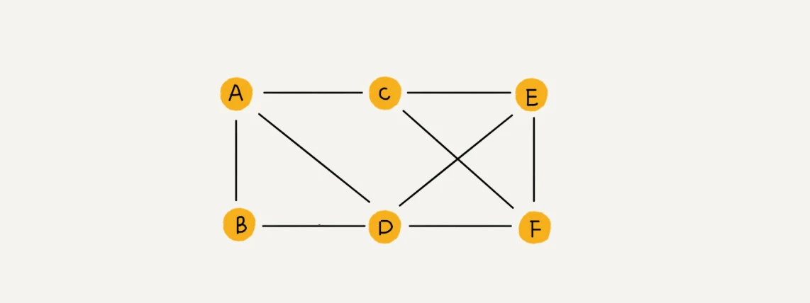
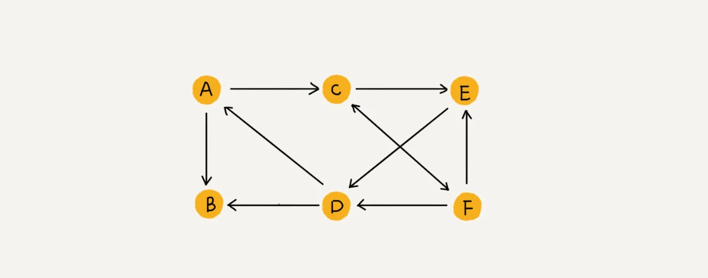
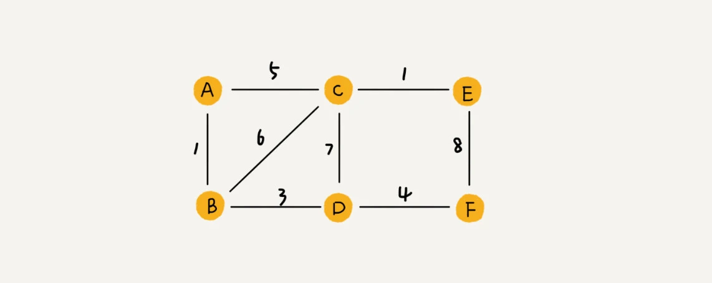
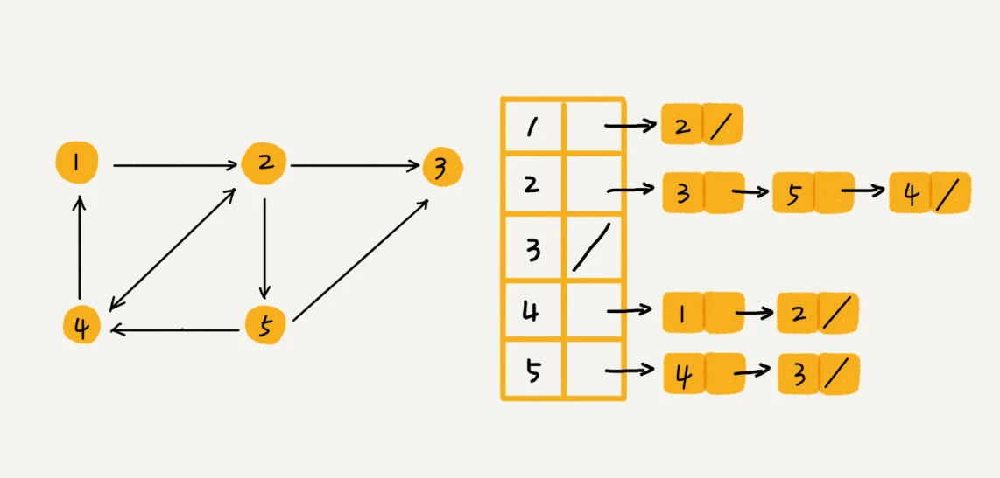
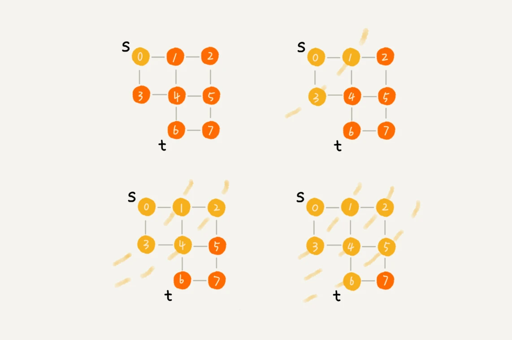
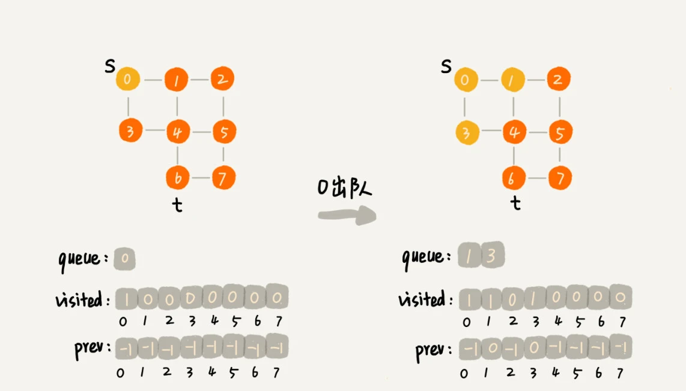
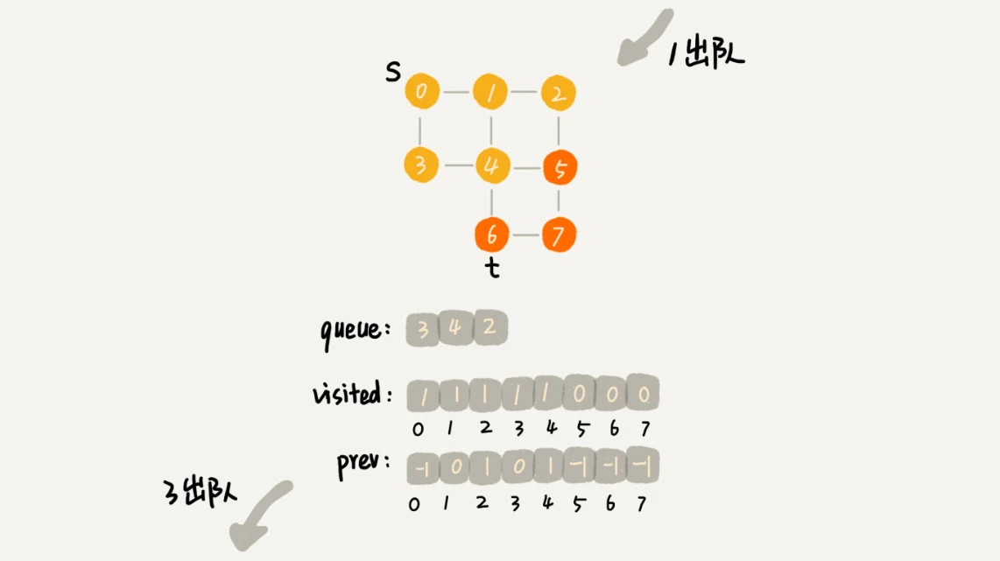
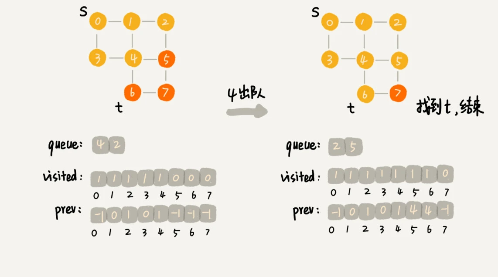
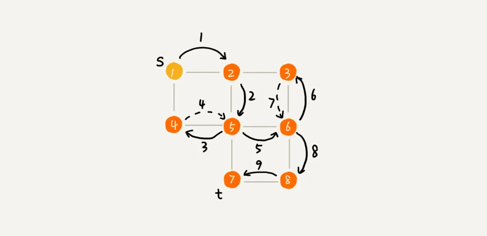

# 认识图

## 图的相关概念

我们前面讲过了树这种非线性表数据结构，今天我们要讲另一种非线性表数据结构，图（Graph）。和树比起来，这是一种更加复杂的非线性表结构

我们知道，树中的元素我们称为节点，图中的元素我们就叫做顶点（vertex）。
从我画的图中可以看出来，图中的一个顶点可以与任意其他顶点建立连接关系。我们把这种建立的关系叫做边（edge）

我们生活中就有很多符合图这种结构的例子。比如，开篇问题中讲到的社交网络，就是一个非常典型的图结构。

我们就拿微信举例子吧。我们可以把每个用户看作一个顶点。如果两个用户之间互加好友，那就在两者之间建立一条边。所以，整个微信的好友关系就可以用一张图
来表示。其中，每个用户有多少个好友，对应到图中，就叫做顶点的度（degree），就是跟顶点相连接的边的条数。

实际上，微博的社交关系跟微信还有点不一样，或者说更加复杂一点。微博允许单向关注，也就是说，用户 A 关注了用户 B，但用户 B
可以不关注用户 A。那我们如何用图来表示这种单向的社交关系呢？

我们可以把刚刚讲的图结构稍微改造一下，引入边的“方向”的概念。

如果用户 A 关注了用户 B，我们就在图中画一条从 A 到 B 的带箭头的边，来表示边的方向。如果用户 A 和用户 B 互相关注了，那我们就画一条从
A 指向 B 的边，再画一条从 B 指向 A 的边。我们把这种边有方向的图叫做“有向图”。以此类推，我们把边没有方向的图就叫做“无向图”

我们刚刚讲过，无向图中有“度”这个概念，表示一个顶点有多少条边。在有向图中，我们把度分为入度（In-degree）和出度（Out-degree）。

顶点的入度，表示有多少条边指向这个顶点；顶点的出度，表示有多少条边是以这个顶点为起点指向其他顶点。对应到微博的例子，入度就表示有多少粉丝，出度就表示关注了多少人。

前面讲到了微信、微博、无向图、有向图，现在我们再来看另一种社交软件：QQ。

QQ 中的社交关系要更复杂一点。不知道你有没有留意过 QQ 亲密度这样一个功能。QQ
不仅记录了用户之间的好友关系，还记录了两个用户之间的亲密度，如果两个用户经常往来，那亲密度就比较高；如果不经常往来，亲密度就比较低。如何在图中记录这种好友关系的亲密度呢？

这里就要用到另一种图，**带权图（weighted graph）**。在带权图中，每条边都有一个权重（weight），我们可以通过这个权重来表示 QQ
好友间的亲密度。

## 图的存储

### 1. 邻接矩阵法

图最直观的一种存储方法就是，邻接矩阵（Adjacency Matrix）。

邻接矩阵的底层依赖一个二维数组。对于无向图来说，如果顶点 i 与顶点 j 之间有边，我们就将 A[i][j]和 A[j][i]标记为
1；对于有向图来说，如果顶点 i 到顶点 j 之间，有一条箭头从顶点 i 指向顶点 j 的边，那我们就将 A[i][j]标记为 1。同理，如果有一条箭头从顶点
j 指向顶点 i 的边，我们就将 A[j][i]标记为 1。对于带权图，数组中就存储相应的权重。

用邻接矩阵来表示一个图，虽然简单、直观，但是比较浪费存储空间

对于无向图来说，如果 A[i][j]等于 1，那 A[j][i]也肯定等于1。实际上，我们只需要存储一个就可以了。也就是说，无向图的二维数组中，
如果我们将其用对角线划分为上下两部分，那我们只需要利用上面或者下面这样一半的空间就足够了，另外一半白白浪费掉了。

还有，如果我们存储的是稀疏图（Sparse
Matrix），也就是说，顶点很多，但每个顶点的边并不多，那邻接矩阵的存储方法就更加浪费空间了。比如微信有好几亿的用户，对应到图上就是好几亿的顶点。
但是每个用户的好友并不会很多，一般也就三五百个而已。如果我们用邻接矩阵来存储，那绝大部分的存储空间都被浪费了

但这也并不是说，邻接矩阵的存储方法就完全没有优点。首先，邻接矩阵的存储方式简单、直接，因为基于数组，所以在获取两个顶点的关系时，就非常高效。
其次，用邻接矩阵存储图的另外一个好处是方便计算。这是因为，用邻接矩阵的方式存储图，可以将很多图的运算转换成矩阵之间的运算。
比如求解最短路径问题时会提到一个Floyd-Warshall算法，就是利用矩阵循环相乘若干次得到结果。

### 2. 邻接表存储法

我画了一张邻接表的图，你可以先看下。乍一看，邻接表是不是有点像散列表？每个顶点对应一条链表，链表中存储的是与这个顶点相连接的其他顶点。
另外我需要说明一下，图中画的是一个有向图的邻接表存储方式，每个顶点对应的链表里面，存储的是指向的顶点。对于无向图来说，也是类似的，
不过，每个顶点的链表中存储的，是跟这个顶点有边相连的顶点，你可以自己画下

还记得我们之前讲过的时间、空间复杂度互换的设计思想吗？邻接矩阵存储起来比较浪费空间，但是使用起来比较节省时间。
相反，邻接表存储起来比较节省空间，但是使用起来就比较耗时间。

#### 小结

邻接矩阵存储方法的缺点是比较浪费空间，但是优点是查询效率高，而且方便矩阵运算。邻接表存储方法中每个顶点都对应一个链表，存储与其相连接的其他顶点。
尽管邻接表的存储方式比较节省存储空间，但链表不方便查找，所以查询效率没有邻接矩阵存储方式高。针对这个问题，邻接表还有改进升级版，即将链表换成更加高效的动态数据结构，
比如平衡二叉查找树、跳表、散列表等

## 图的遍历

**什么是搜索算法？**

我们知道，算法是作用于具体数据结构之上的，深度优先搜索算法和广度优先搜索算法都是基于“图”这种数据结构的。这是因为，图这种数据结构的表达能力很强，大部分涉及搜索的场景都可以抽象成“图”。

图上的搜索算法，最直接的理解就是，在图中找出从一个顶点出发，到另一个顶点的路径。具体方法有很多，比如今天要讲的两种最简单、最“暴力”的深度优先、广度优先搜索，还有
A*、IDA* 等启发式搜索算法。

### 广度优先搜索

广度优先搜索（Breadth-First-Search），我们平常都简称
BFS。直观地讲，它其实就是一种“地毯式”层层推进的搜索策略，即先查找离起始顶点最近的，然后是次近的，依次往外搜索。理解起来并不难，所以我画了一张示意图，你可以看下。

这里面，bfs() 函数就是基于之前定义的，图的广度优先搜索的代码实现。其中 s 表示起始顶点，t 表示终止顶点。我们搜索一条从 s 到 t
的路径。实际上，这样求得的路径就是从 s 到 t 的最短路径。

具体代码可见`graph.go`, 下面给出完整的bfs的示意图

 

 

最坏情况下，终止顶点 t 离起始顶点 s 很远，需要遍历完整个图才能找到。这个时候，每个顶点都要进出一遍队列，每个边也都会被访问一次，
所以，广度优先搜索的时间复杂度是 O(V+E)，其中，V 表示顶点的个数，E 表示边的个数。当然，对于一个连通图来说，也就是说一个图中的所有顶点都是连通的，
E 肯定要大于等于 V-1，所以，广度优先搜索的时间复杂度也可以简写为 O(E)

广度优先搜索的空间消耗主要在几个辅助变量 visited 数组、queue 队列、prev 数组上。这三个存储空间的大小都不会超过顶点的个数，所以空间复杂度是
O(V)

### 深度优先搜索

深度优先搜索（Depth-First-Search），简称 DFS。最直观的例子就是“走迷宫”。

假设你站在迷宫的某个岔路口，然后想找到出口。你随意选择一个岔路口来走，走着走着发现走不通的时候，你就回退到上一个岔路口，重新选择一条路继续走，直到最终找到出口。这种走法就是一种深度优先搜索策略

我用深度递归算法，把整个搜索的路径标记出来了。这里面实线箭头表示遍历，虚线箭头表示回退。从图中我们可以看出，深度优先搜索找出来的路径，并不是顶点 s 到顶点 t 的最短路径。

从我前面画的图可以看出，每条边最多会被访问两次，一次是遍历，一次是回退。所以，图上的深度优先搜索算法的时间复杂度是 O(E)，E 表示边的个数。

深度优先搜索算法的消耗内存主要是 visited、prev 数组和递归调用栈。visited、prev 数组的大小跟顶点的个数 V 成正比，递归调用栈的最大深度不会超过顶点的个数，所以总的空间复杂度就是 O(V)。
