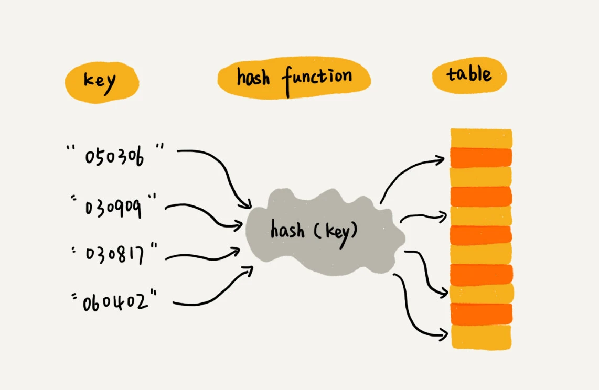
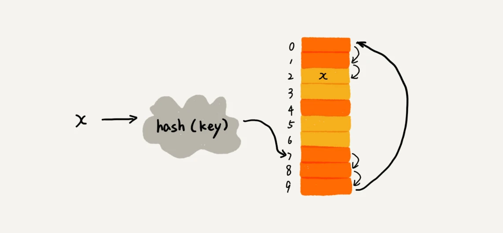
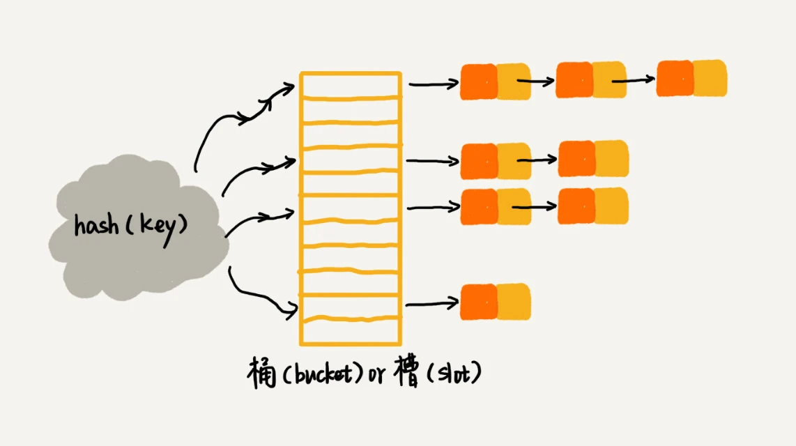

# 散列表

**概念**:
散列表用的是数组支持按照下标随机访问数据的特性，所以散列表其实就是数组的一种扩展，由数组演化而来。可以说，如果没有数组，就没有散列表



我们可以总结出这样的规律：散列表用的就是数组支持按照下标随机访问的时候，时间复杂度是 O(1)
的特性。我们通过散列函数把元素的键值映射为下标，然后将数据存储在数组中对应下标的位置。当我们按照键值查询元素时，我们用同样的散列函数，将键值转化数组下标，从对应的数组下标的位置取数据。

**散列函数设计的基本要求:**

1. 散列函数计算得到的散列值是一个非负整数
2. 如果 key1 = key2，那 hash(key1) == hash(key2)；
3. 如果 key1 ≠ key2，那 hash(key1) ≠ hash(key2)。

解释一下这三点。其中，第一点理解起来应该没有任何问题。因为数组下标是从 0 开始的，所以散列函数生成的散列值也要是非负整数。第二点也很好理解。相同的
key，经过散列函数得到的散列值也应该是相同的。

第三点理解起来可能会有问题，我着重说一下。这个要求看起来合情合理，但是在真实的情况下，要想找到一个不同的 key
对应的散列值都不一样的散列函数，几乎是不可能的。即便像业界著名的MD5、SHA、CRC等哈希算法，也无法完全避免这种散列冲突。而且，因为数组的存储空间有限，也会加大散列冲突的概率

## 散列冲突

### 1. 开放寻址法

开放寻址法的核心思想是，如果出现了散列冲突，我们就重新探测一个空闲位置，将其插入。那如何重新探测新的位置呢？我先讲一个比较简单的探测方法，线性探测（Linear
Probing）。

当我们往散列表中插入数据时，如果某个数据经过散列函数散列之后，存储位置已经被占用了，我们就从当前位置开始，依次往后查找，看是否有空闲位置，直到找到为止。



对于开放寻址冲突解决方法，除了线性探测方法之外，还有另外两种比较经典的探测方法，二次探测（Quadratic probing）和双重散列（Double
hashing）。

所谓二次探测，跟线性探测很像，线性探测每次探测的步长是 1，那它探测的下标序列就是 hash(key)+0，hash(key)+1，hash(key)
+2……而二次探测探测的步长就变成了原来的“二次方”，也就是说，它探测的下标序列就是 hash(key)+0，hash(key)+12，hash(key)
+22……

所谓双重散列，意思就是不仅要使用一个散列函数。我们使用一组散列函数 hash1(key)，hash2(key)，hash3(key)
……我们先用第一个散列函数，如果计算得到的存储位置已经被占用，再用第二个散列函数，依次类推，直到找到空闲的存储位置。

不管采用哪种探测方法，当散列表中空闲位置不多的时候，散列冲突的概率就会大大提高。为了尽可能保证散列表的操作效率，一般情况下，我们会尽可能保证散列表中有一定比例的空闲槽位。我们用装载因子（load
factor）来表示空位的多少

```text
散列表的装载因子=填入表中的元素个数/散列表的长度
```

装载因子越大，说明空闲位置越少，冲突越多，散列表的性能会下降

### 2. 链表法

链表法是一种更加常用的散列冲突解决办法，相比开放寻址法，它要简单很多。我们来看这个图，在散列表中，每个“桶（bucket）”或者“槽（slot）”会对应一条链表，所有
散列值相同的元素我们都放到相同槽位对应的链表中



## 设计一个工业级别的散列表

如何设计一个可以应对各种异常情况的工业级散列表，来避免在散列冲突的情况下，散列表性能的急剧下降，并且能抵抗散列碰撞攻击？

### 散列函数的设计

### 装载因子的动态调整

### 如何避免低效的扩容

### 如何选择冲突解决方案

##### 思考题

课后思考今天讲的几个散列表和链表结合使用的例子里，我们用的都是双向链表。如果把双向链表改成单链表，还能否正常工作呢？为什么呢？

假设猎聘网有 10 万名猎头，每个猎头都可以通过做任务（比如发布职位）来积累积分，然后通过积分来下载简历。假设你是猎聘网的一名工程师，如何在内存中存储这
10 万个猎头 ID 和积分信息，让它能够支持这样几个操作：

1. 根据猎头的 ID 快速查找、删除、更新这个猎头的积分信息；
2. 查找积分在某个区间的猎头 ID 列表；
3. 查找按照积分从小到大排名在第 x 位到第 y 位之间的猎头 ID 列表。

# 哈希算法

**哈希算法的定义：**
将任意长度的二进制值串映射为固定长度的二进制值串， 映射规则即为哈希算法，得到的值为哈希值， 要求：不能反向推导出原始数据、敏感度高、冲突概率低、高效计算

# 哈希算法的应用

## 应用一: 安全加密

- 常用加密算法：MD5、SHA、DES、AES
- 要求：难以反向推导、冲突概率低
- 鸽巢原理：哈希算法无法做到零冲突

## 应用二：唯一标识

- 通过哈希算法生成唯一标识
- 用于图库中搜索图片是否存在
- 散列表存储唯一标识和文件路径

## 应用三：数据校验

- 通过哈希算法校验文件块的安全、正确、完整
- 比对哈希值与种子文件中的哈希值

## 应用四：散列函数

散列函数中用到的散列算法，更加关注散列后的值是否能平均分布，也就是，一组数据是否能均匀地散列在各个槽中。除此之外，散列函数执行的快慢，也会影响散列表的性能，所以，散列函数用的散列算法一般都比较简单，比较追求效率。

## 应用五: 负载均衡

我们知道，负载均衡算法有很多，比如轮询、随机、加权轮询等。那如何才能实现一个会话粘滞（session
sticky）的负载均衡算法呢？也就是说，我们需要在同一个客户端上，在一次会话中的所有请求都路由到同一个服务器上。

最直接的方法就是，维护一张映射关系表，这张表的内容是客户端 IP 地址或者会话 ID
与服务器编号的映射关系。客户端发出的每次请求，都要先在映射表中查找应该路由到的服务器编号，然后再请求编号对应的服务器。这种方法简单直观，但也有几个弊端：

- 如果客户端很多，映射表可能会很大，比较浪费内存空间；
- 客户端下线、上线，服务器扩容、缩容都会导致映射失效，这样维护映射表的成本就会很大；

如果借助哈希算法，这些问题都可以非常完美地解决。我们可以通过哈希算法，**对客户端 IP 地址或者会话 ID
计算哈希值，将取得的哈希值与服务器列表的大小进行取模运算，最终得到的值就是应该被路由到的服务器编号**。 这样，我们就可以把同一个
IP 过来的所有请求，都路由到同一个后端服务器上。

## 应用六: 数据分片

### 1. 如何统计“搜索关键词”出现的次数

假如我们有 1T
的日志文件，这里面记录了用户的搜索关键词，我们想要快速统计出每个关键词被搜索的次数，该怎么做呢？我们来分析一下。

这个问题有两个难点，第一个是搜索日志很大，没办法放到一台机器的内存中。第二个难点是，如果只用一台机器来处理这么巨大的数据，处理时间会很长。

针对这两个难点，我们可以先对数据进行分片，然后采用多台机器处理的方法，来提高处理速度。具体的思路是这样的：为了提高处理的速度，我们用
n 台机器并行处理。我们从搜索记录的日志文件中，依次读出每个搜索关键词，并且通过哈希函数计算哈希值，然后再跟 n
取模，最终得到的值，就是应该被分配到的机器编号。

这样，哈希值相同的搜索关键词就被分配到了同一个机器上。也就是说，同一个搜索关键词会被分配到同一个机器上。每个机器会分别计算关键词出现的次数，最后合并起来就是最终的结果。

实际上，这里的处理过程也是MapReduce 的基本设计思想。

### 2. 如何快速判断图片是否在图库中？

**具体方法**

我们同样可以对数据进行分片，然后采用多机处理。我们准备 n 台机器，让每台机器只维护某一部分图片对应的散列表。我们每次从图库中读取一个图片，计算唯一标识，然后与机器个数
n 求余取模，得到的值就对应要分配的机器编号，然后将这个图片的唯一标识和图片路径发往对应的机器构建散列表。当我们要判断一个图片是否在图库中的时候，我们通过同样的哈希算法，计算这个图片的唯一标识，然后与机器个数
n 求余取模。假设得到的值是 k，那就去编号 k 的机器构建的散列表中查找。

**资源估算**

散列表中每个数据单元包含两个信息，哈希值和图片文件的路径。假设我们通过 MD5 来计算哈希值，那长度就是 128 比特，也就是 16
字节。文件路径长度的上限是 256 字节，我们可以假设平均长度是 128 字节。如果我们用链表法来解决冲突，那还需要存储指针，指针只占用
8 字节。所以，散列表中每个数据单元就占用 152 字节（这里只是估算，并不准确）。

## 应用七：分布式存储

**一致性哈希算法**