# 字符串匹配

从今天开始，我们来学习字符串匹配算法。字符串匹配这样一个功能，我想对于任何一个开发工程师来说，应该都不会陌生。我们用的最多的就是编程语言提
供的字符串查找函数，比如 Java 中的 indexOf()，Python 中的 find() 函数等，它们底层就是依赖接下来要讲的字符串匹配算法。

字符串匹配算法很多，我会分四节来讲解。今天我会讲两种比较简单的、好理解的，它们分别是：BF 算法和 RK 算法。
下一节，我会讲两种比较难理解、但更加高效的，它们是：BM 算法和 KMP 算法。

这两节讲的都是单模式串匹配的算法，也就是一个串跟一个串进行匹配。第三节、第四节，我会讲两种多模式串匹配算法，也就是在一个串中同时查找多个串，
它们分别是 Trie 树和 AC 自动机

## BF算法

BF 算法中的 BF 是 Brute Force 的缩写，中文叫作暴力匹配算法，也叫朴素匹配算法。从名字可以看出，这种算法的字符串匹配方式很“暴力”，
当然也就会比较简单、好懂，但相应的性能也不高

在开始讲解这个算法之前，我先定义两个概念，方便我后面讲解。它们分别是主串和模式串。这俩概念很好理解，我举个例子你就懂了

比方说，我们在字符串 A 中查找字符串 B，那字符串 A 就是主串，字符串 B 就是模式串。我们把主串的长度记作 n，模式串的长度记作 m。
因为我们是在主串中查找模式串，所以 n>m

作为最简单、最暴力的字符串匹配算法，BF 算法的思想可以用一句话来概括，那就是，我们在主串中，检查起始位置分别是 0、1、2....n-m
且长度为 m 的
n-m+1 个子串，看有没有跟模式串匹配的。我举一个例子给你看看，你应该可以理解得更清楚

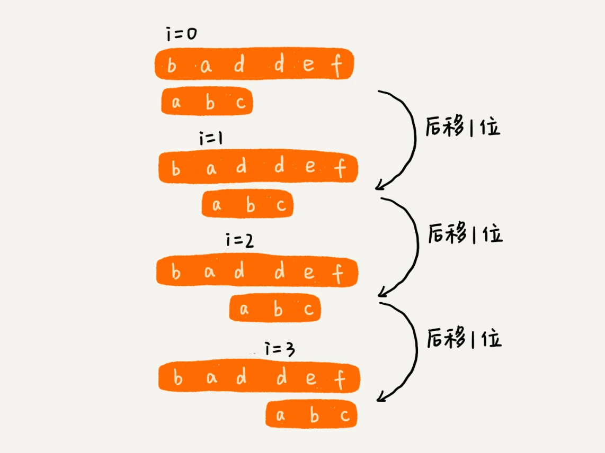

从上面的算法思想和例子，我们可以看出，在极端情况下，比如主串是“aaaaa....aaaaaa”（省略号表示有很多重复的字符 a），模式串是“aaaaab”。
我们每次都比对 m 个字符，要比对 n-m+1 次，所以，这种算法的最坏情况时间复杂度是 O(n*m)

尽管理论上，BF 算法的时间复杂度很高，是 O(n*m)，但在实际的开发中，它却是一个比较常用的字符串匹配算法。为什么这么说呢？原因有两点。

第一，实际的软件开发中，大部分情况下，模式串和主串的长度都不会太长。而且每次模式串与主串中的子串匹配的时候，当中途遇到不能匹配的字符的时候，就可以就停止了，不需要把
m 个字符都比对一下。所以，尽管理论上的最坏情况时间复杂度是 O(n*m)，但是，统计意义上，大部分情况下，算法执行效率要比这个高很多

第二，朴素字符串匹配算法思想简单，代码实现也非常简单。简单意味着不容易出错，如果有 bug
也容易暴露和修复。在工程中，在满足性能要求的前提下，简单是首选。这也是我们常说的KISS（Keep it Simple and Stupid）设计原则。

所以，在实际的软件开发中，绝大部分情况下，朴素的字符串匹配算法就够用了。

## RK算法

RK 算法的全称叫 Rabin-Karp 算法，是由它的两位发明者 Rabin 和 Karp 的名字来命名的。这个算法理解起来也不是很难。我个人觉得，它其实就是刚刚讲的
BF 算法的升级版。

我在讲 BF 算法的时候讲过，如果模式串长度为 m，主串长度为 n，那在主串中，就会有 n-m+1 个长度为 m 的子串，我们只需要暴力地对比这
n-m+1 个子串与模式串，就可以找出主串与模式串匹配的子串。

但是，每次检查主串与子串是否匹配，需要依次比对每个字符，所以 BF 算法的时间复杂度就比较高，是 O(n*m)
。我们对朴素的字符串匹配算法稍加改造，引入哈希算法，时间复杂度立刻就会降低。

RK 算法的思路是这样的：我们通过哈希算法对主串中的 n-m+1
个子串分别求哈希值，然后逐个与模式串的哈希值比较大小。如果某个子串的哈希值与模式串相等，那就说明对应的子串和模式串匹配了（这里先不考虑哈希冲突的问题，后面我们会讲到）。因为哈希值是一个数字，数字之间比较是否相等是非常快速的，所以模式串和子串比较的效率就提高了

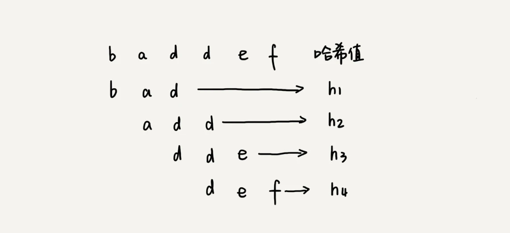

不过，通过哈希算法计算子串的哈希值的时候，我们需要遍历子串中的每个字符。尽管模式串与子串比较的效率提高了，但是，算法整体的效率并没有提高。有没有方法可以提高哈希算法计算子串哈希值的效率呢？

这就需要哈希算法设计的非常有技巧了。我们假设要匹配的字符串的字符集中只包含 K 个字符，我们可以用一个 K 进制数来表示一个子串，这个
K 进制数转化成十进制数，作为子串的哈希值。表述起来有点抽象，我举了一个例子，看完你应该就能懂了。

比如要处理的字符串只包含 a～z 这 26 个小写字母，那我们就用二十六进制来表示一个字符串。我们把 a～z 这 26 个字符映射到 0～25 这
26 个数字，a 就表示 0，b 就表示 1，以此类推，z 表示 25。

在十进制的表示法中，一个数字的值是通过下面的方式计算出来的。对应到二十六进制，一个包含 a 到 z 这 26
个字符的字符串，计算哈希的时候，我们只需要把进位从 10 改成 26 就可以。

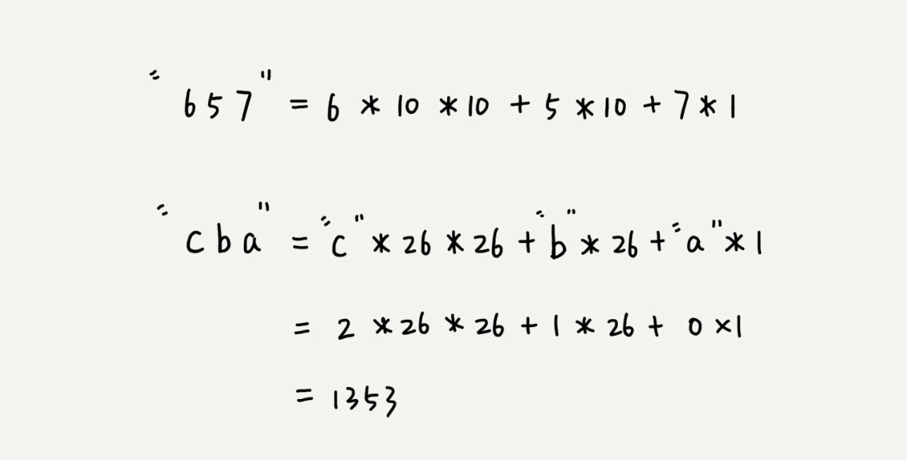

这种哈希算法有一个特点，在主串中，相邻两个子串的哈希值的计算公式有一定关系。我这有个例子，你先找一下规律，再来看我后面的讲解。

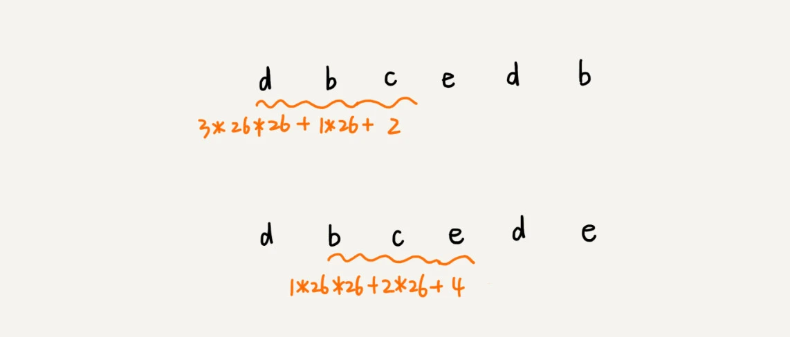

从这里例子中，我们很容易就能得出这样的规律：相邻两个子串 s[i-1]和 s[i]（i 表示子串在主串中的起始位置，子串的长度都为
m），对应的哈希值计算公式有交集，也就是说，我们可以使用 s[i-1]的哈希值很快的计算出 s[i]的哈希值。如果用公式表示的话，就是下面这个样子：

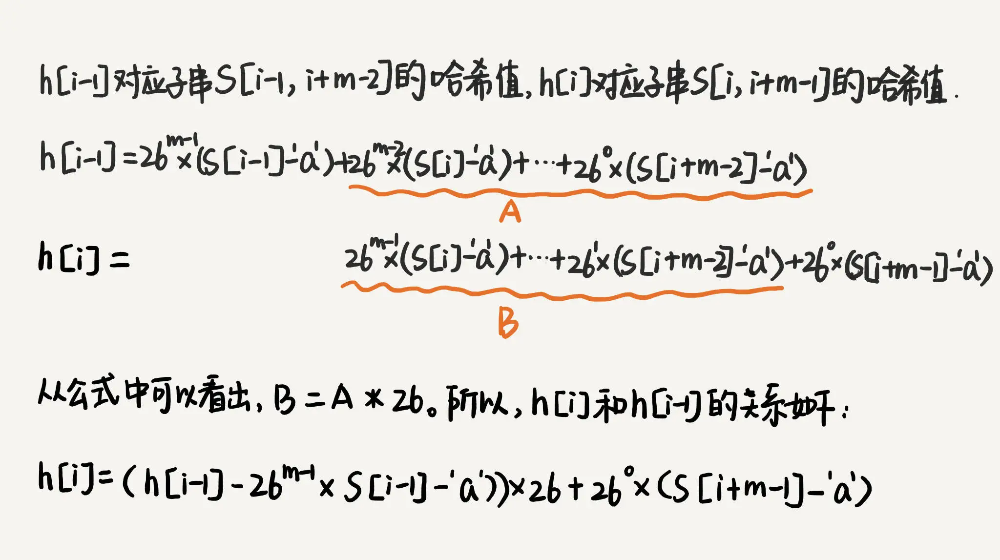

不过，这里有一个小细节需要注意，那就是 26^(m-1) 这部分的计算，我们可以通过查表的方法来提高效率。我们事先计算好
26^0、26^1、26^2……26^(m-1)，并且存储在一个长度为 m 的数组中，公式中的“次方”就对应数组的下标。当我们需要计算 26 的 x
次方的时候，就可以从数组的下标为 x 的位置取值，直接使用，省去了计算的时间。

### RK算法的时间复杂度分析

整个 RK 算法包含两部分，计算子串哈希值和模式串哈希值与子串哈希值之间的比较。第一部分，我们前面也分析了，可以通过设计特殊的哈希算法，只需要扫描一遍主串就能计算出所有子串的哈希值了，所以这部分的时间复杂度是
O(n)。

## BM（Boyer-Moore）算法

它是一种非常高效的字符串匹配算法，有实验统计，它的性能是著名的KMP 算法的 3 到 4 倍。BM
算法的原理很复杂，比较难懂，学起来会比较烧脑，我会尽量给你讲清楚，同时也希望你做好打硬仗的准备。好，现在我们正式开始！

### BM 算法的核心思想

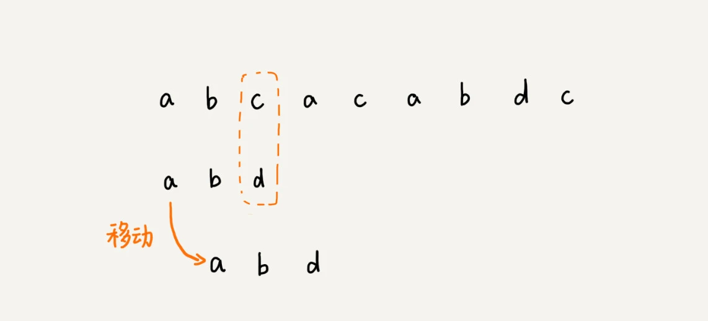

在这个例子里，主串中的 c，在模式串中是不存在的，所以，模式串向后滑动的时候，只要 c
与模式串没有重合，肯定无法匹配。所以，我们可以一次性把模式串往后多滑动几位，把模式串移动到 c 的后面

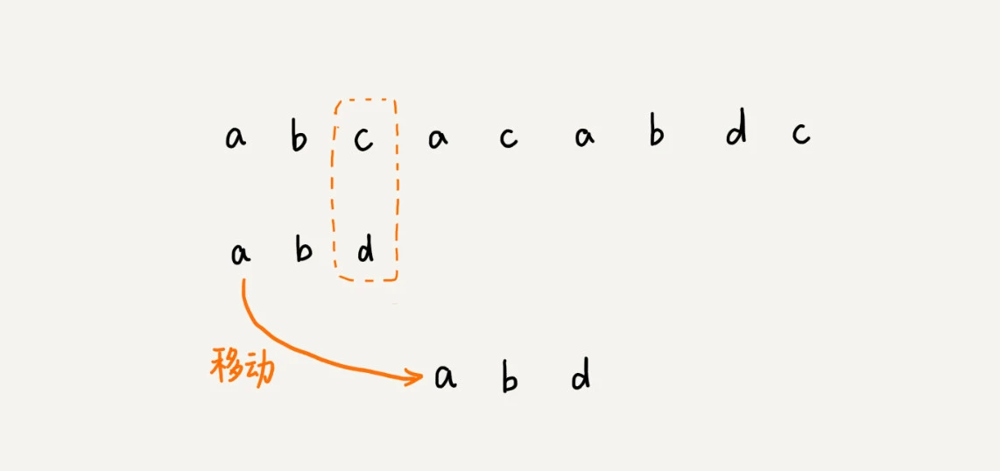

由现象找规律，你可以思考一下，当遇到不匹配的字符时，有什么固定的规律，可以将模式串往后多滑动几位呢？这样一次性往后滑动好几位，那匹配的效率岂不是就提高了？

我们今天要讲的 BM 算法，本质上其实就是在寻找这种规律。借助这种规律，在模式串与主串匹配的过程中，当模式串和主串某个字符不匹配的时候，能够跳过一些肯定不会匹配的情况，将模式串往后多滑动几位

### BM 算法的原理分析

BM 算法包含两部分，分别是**坏字符规则（bad character rule）**和**好后缀规则（good suffix shift）**。我们下面依次来看，这两个规则分别都是怎么工作的。

#### 1. 坏字符规则

BM 算法的匹配顺序比较特别，它是按照模式串下标从大到小的顺序，倒着匹配的。我画了一张图，你可以看下。

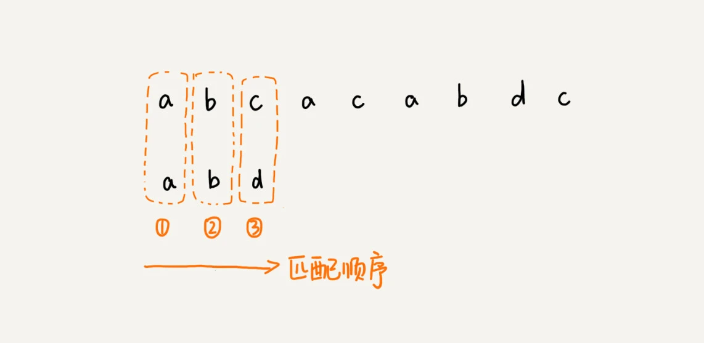
<br>
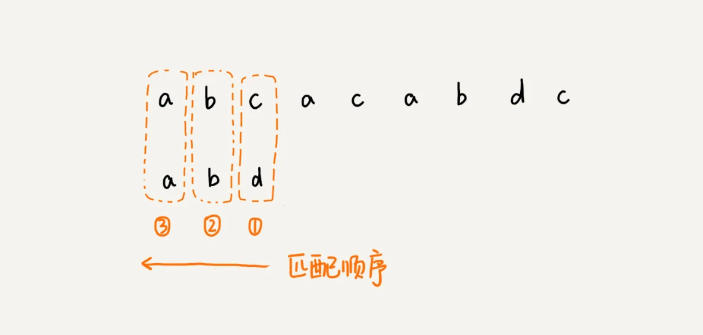

从模式串的末尾往前倒着匹配，当发现某个字符没法匹配的时候，我们把这个没有匹配的字符叫作坏字符（主串中的字符）。

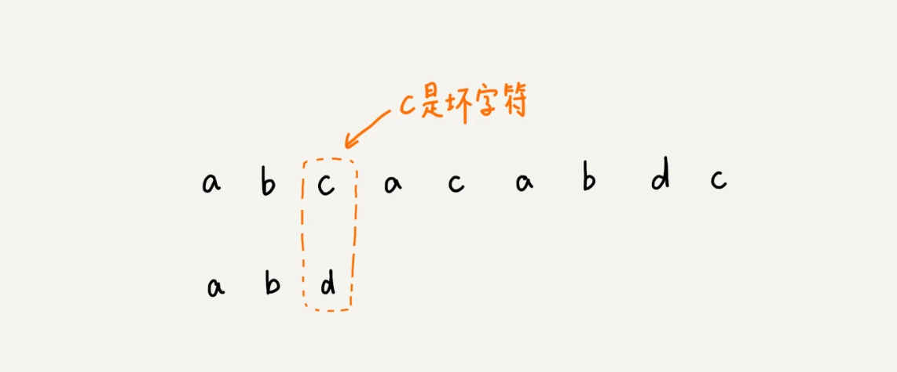

我们拿坏字符 c 在模式串中查找，发现模式串中并不存在这个字符，也就是说，字符 c
与模式串中的任何字符都不可能匹配。这个时候，我们可以将模式串直接往后滑动三位，将模式串滑动到 c 后面的位置，再从模式串的末尾字符开始比较

当发生不匹配的时候，我们把坏字符对应的模式串中的字符下标记作 si。如果坏字符在模式串中存在，我们把这个坏字符在模式串中的下标记作
xi。如果不存在，我们把 xi 记作 -1。那模式串往后移动的位数就等于 si-xi。（注意，我这里说的下标，都是字符在模式串的下标）。

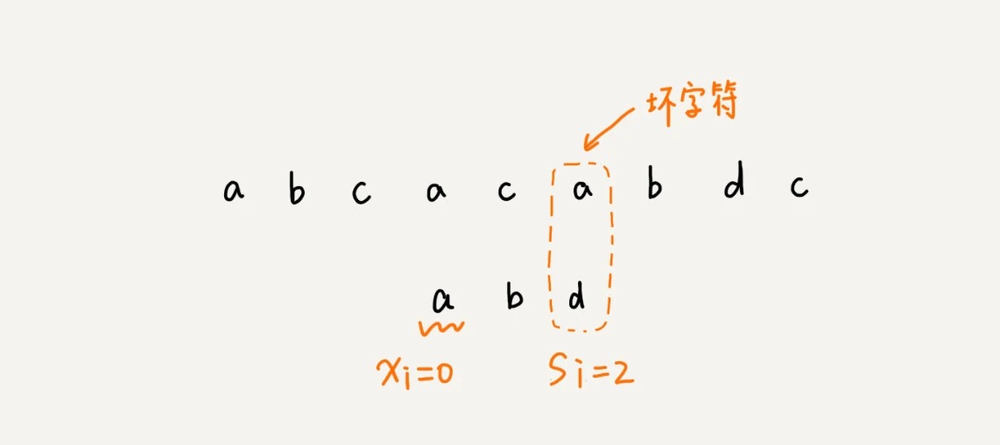

这里我要特别说明一点，如果坏字符在模式串里多处出现，那我们在计算 xi 的时候，选择最靠后的那个，因为这样不会让模式串滑动过多，导致本来可能匹配的情况被滑动略过。

利用坏字符规则，BM 算法在最好情况下的时间复杂度非常低，是 O(n/m)。比如，主串是 aaabaaabaaabaaab，模式串是
aaaa。每次比对，模式串都可以直接后移四位，所以，匹配具有类似特点的模式串和主串的时候，BM 算法非常高效。

不过，单纯使用坏字符规则还是不够的。因为根据 si-xi 计算出来的移动位数，有可能是负数，比如主串是 aaaaaaaaaaaaaaaa，模式串是
baaa。不但不会向后滑动模式串，还有可能倒退。所以，BM 算法还需要用到“好后缀规则”。

#### 2. 好后缀规则

好后缀规则实际上跟坏字符规则的思路很类似。你看我下面这幅图。当模式串滑动到图中的位置的时候，模式串和主串有 2 个字符是匹配的，倒数第
3 个字符发生了不匹配的情况。

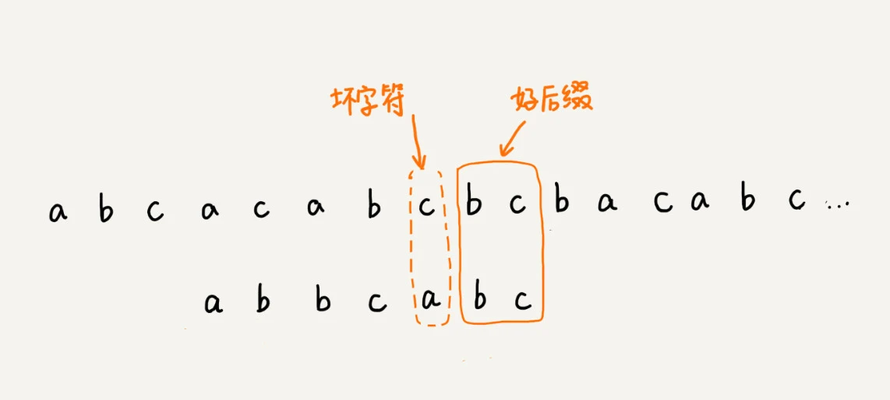

这个时候该如何滑动模式串呢？当然，我们还可以利用坏字符规则来计算模式串的滑动位数，不过，我们也可以使用好后缀处理规则。两种规则到底如何选择，我稍后会讲。抛开这个问题，现在我们来看，好后缀规则是怎么工作的？

我们把已经匹配的 bc 叫作好后缀，记作{u}。我们拿它在模式串中查找，如果找到了另一个跟{u}相匹配的子串{u*}，那我们就将模式串滑动到子串{u*}与主串中{u}对齐的位置

## KMP算法

## KMP（Knuth-Morris-Pratt）算法原理

KMP 算法是一种高效的字符串匹配算法，用于在主串 `S` 中查找子串 `P`。它的核心思想是 **利用已匹配的信息来避免重复匹配**，从而提高匹配效率。

### 1. 朴素匹配问题
在传统的 **暴力匹配算法** 中，我们尝试从主串 `S` 的每个位置开始与子串 `P` 进行匹配：
- 如果匹配成功，则返回匹配位置；
- 如果匹配失败，则回溯主串 `S` 的指针，从 `S` 的下一个字符继续匹配。

最坏情况下，暴力匹配的时间复杂度是 **O(n × m)**（`n` 为主串长度，`m` 为子串长度），因为匹配失败时要回溯 `S` 的指针。

### 2. KMP 如何优化？
KMP 的核心优化在于 **前缀表（partial match table，简称 `next` 数组）**，它用于存储子串 `P` 的 **最长相同前后缀**，以便在匹配失败时跳过不必要的字符，从而减少匹配次数。

#### **前缀表（Next 数组）**
`next[i]` 表示 **子串 P[0:i]（前 i 个字符）中最长的相同前后缀的长度**。  
例如，对于字符串 `ABABAC`：

| 位置 | 子串 | `next` 数组值（最长前后缀长度） |
|------|------|----------------|
| 0    | A    | 0              |
| 1    | AB   | 0              |
| 2    | ABA  | 1              |
| 3    | ABAB | 2              |
| 4    | ABABA| 3              |
| 5    | ABABAC| 0             |

**计算 next 数组**
1. 设 `j` 为当前匹配的最长前后缀长度，`i` 为当前考察的位置。
2. 初始时 `j = 0`，遍历 `i = 1` 到 `m-1`：
    - 若 `P[i] == P[j]`，说明可以扩展前后缀，令 `next[i] = j + 1`，然后 `j++`；
    - 若 `P[i] != P[j]`，则回溯 `j = next[j-1]`，直到 `j == 0` 或者找到新的匹配。

#### **利用 `next` 数组进行匹配**
- 遍历 `S` 时，如果 `S[i] == P[j]`，则 `i++`，`j++`；
- 若 `S[i] != P[j]`：
    - 若 `j > 0`，则 **根据 `next[j-1]` 跳过部分匹配字符**，即 `j = next[j-1]`；
    - 否则 `i++`（相当于暴力匹配中的回溯）。

这样，我们 **避免了回溯 `i` 的指针，只回溯 `j`**，匹配的时间复杂度优化为 **O(n + m)**。

---

## Golang 实现 KMP 算法

```go
package main

import "fmt"

// 计算 next 数组
func computeNext(P string) []int {
	m := len(P)
	next := make([]int, m)
	j := 0 // 记录前缀的匹配长度

	for i := 1; i < m; i++ {
		// 回溯 j 直到找到匹配的前后缀
		for j > 0 && P[i] != P[j] {
			j = next[j-1]
		}
		// 如果 P[i] == P[j]，说明扩展了前后缀
		if P[i] == P[j] {
			j++
		}
		next[i] = j
	}
	return next
}

// KMP 主函数，查找子串 P 在主串 S 中的起始索引（如果存在）
func KMP(S, P string) []int {
	n, m := len(S), len(P)
	next := computeNext(P)
	j := 0 // 匹配子串 P 的指针
	result := []int{} // 记录匹配位置

	for i := 0; i < n; i++ {
		// 如果不匹配，则按照 next 数组回溯 j
		for j > 0 && S[i] != P[j] {
			j = next[j-1]
		}
		// 如果匹配，继续匹配下一个字符
		if S[i] == P[j] {
			j++
		}
		// 完整匹配 P，记录位置并继续匹配
		if j == m {
			result = append(result, i-m+1)
			j = next[j-1] // 继续匹配
		}
	}
	return result
}

func main() {
	S := "ABABABCABABABCABABABC"
	P := "ABABAC"
	
	fmt.Println("Next 数组:", computeNext(P))
	fmt.Println("匹配位置:", KMP(S, P))
}
```

---

## 代码解析
1. **`computeNext(P string) []int`**
    - 计算 `next` 数组，使用双指针 `i` 和 `j` 遍历 `P`。
    - `next[i]` 记录 `P[0:i]` 的最长相同前后缀长度。

2. **`KMP(S, P string) []int`**
    - 遍历 `S`，若 `S[i] == P[j]`，则 `j++` 继续匹配。
    - 若 `S[i] != P[j]`，则利用 `next` 数组回溯 `j`，避免回溯 `i`。
    - 若 `j == m`，说明子串 `P` 在 `S` 中匹配，记录位置。

3. **`main()`**
    - 测试 `computeNext` 计算出的 `next` 数组是否正确。
    - 调用 `KMP` 进行匹配，并输出所有匹配的位置。

---

## 复杂度分析
- **构建 `next` 数组**：`O(m)`
- **字符串匹配**：`O(n)`
- **总时间复杂度**：`O(n + m)`

相比于暴力匹配 `O(n × m)`，KMP 避免了重复回溯，提高了匹配效率，非常适合 **大规模文本搜索**，如 **DNA 序列比对、文本编辑器搜索、高效日志分析等**。

## Trie树

### Trie树的概念

Trie 树，也叫“字典树”。顾名思义，它是一个树形结构。它是一种专门处理字符串匹配的数据结构，用来解决在一组字符串集合中快速查找某个字符串的问题

我举个简单的例子来说明一下。我们有 6 个字符串，它们分别是：how，hi，her，hello，so，see。我们希望在里面多次查找某个字符串是否存在。如果每次查找，都是拿要查找的字符串跟这
6 个字符串依次进行字符串匹配，那效率就比较低，有没有更高效的方法呢？

这个时候，我们就可以先对这 6 个字符串做一下预处理，组织成 Trie 树的结构，之后每次查找，都是在 Trie 树中进行匹配查找。Trie
树的本质，就是**利用字符串之间的公共前缀，将重复的前缀合并在一起**。最后构造出来的就是下面这个图中的样子

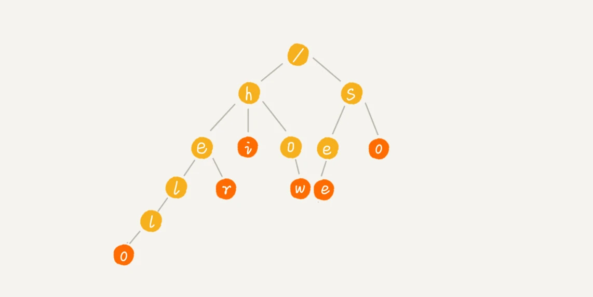

其中，根节点不包含任何信息。每个节点表示一个字符串中的字符，从根节点到红色节点的一条路径表示一个字符串（注意：红色节点并不都是叶子节点）。

为了让你更容易理解 Trie 树是怎么构造出来的，我画了一个 Trie 树构造的分解过程。构造过程的每一步，都相当于往
Trie 树中插入一个字符串。当所有字符串都插入完成之后，Trie 树就构造好了。


<br>
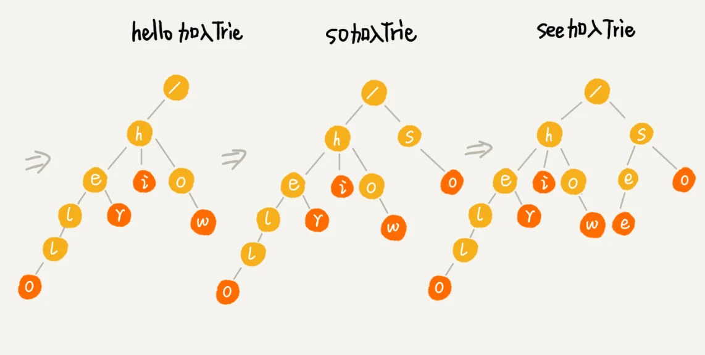

当我们在 Trie 树中查找一个字符串的时候，比如查找字符串“her”，那我们将要查找的字符串分割成单个的字符 h，e，r，然后从 Trie
树的根节点开始匹配。如图所示，绿色的路径就是在 Trie 树中匹配的路径

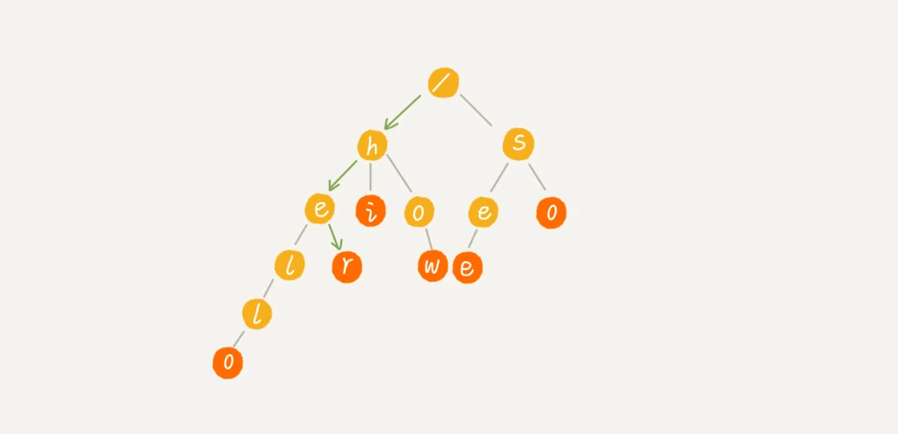

如果我们要查找的是字符串“he”呢？我们还用上面同样的方法，从根节点开始，沿着某条路径来匹配，如图所示，绿色的路径，是字符串“he”匹配的路径。但是，路径的最后一个节点“e”并不是红色的。也就是说，“he”是某个字符串的前缀子串，但并不能完全匹配任何字符串

### Trie树的实现

从刚刚 Trie 树的介绍来看，Trie 树主要有两个操作，一个是将字符串集合构造成 Trie 树。这个过程分解开来的话，就是一个将字符串插入到 Trie 树的过程。另一个是在 Trie 树中查询一个字符串

具体的实现代码可以看`trie.go`

#### 时间复杂度分析

如果要在一组字符串中，频繁地查询某些字符串，用 Trie 树会非常高效。构建 Trie 树的过程，需要扫描所有的字符串，时间复杂度是 O(n)
（n 表示所有字符串的长度和）。但是一旦构建成功之后，后续的查询操作会非常高效

每次查询时，如果要查询的字符串长度是 k，那我们只需要比对大约 k 个节点，就能完成查询操作。跟原本那组字符串的长度和个数没有任何关系。所以说，构建好
Trie 树后，在其中查找字符串的时间复杂度是 O(k)，k 表示要查找的字符串的长度

### Trie树是否耗内存？

是的，**Trie 树（前缀树）通常会占用较多内存**，主要原因如下：

---

## **1. Trie 树的内存消耗来源**
Trie 树的内存主要消耗在 **存储每个节点的子节点指针** 和 **额外的信息字段**，具体如下：

### **(1) 每个节点存储多个子节点**
- 在标准 Trie 实现中，每个节点通常会有一个 **固定大小的子节点数组**（如果是 26 个小写字母，则大小为 26）。
- 在 **稀疏 Trie**（例如仅存储少量单词）中，这可能会导致大量的指针占用内存，但没有被有效利用。

**示例**
假设我们存储 `"apple"` 和 `"apply"` 两个单词，Trie 结构如下：
```
      (root)
       /  
      a    
      |    
      p    
      |    
      p    
     / \   
    l   l  
    |   |  
    e   y  
```
- 每个节点至少存储：
   - **指向子节点的指针**（通常是一个数组，大小视字符集而定）。
   - **是否是单词结尾的标志**（布尔值）。
   - **可能的额外信息**（如词频）。

如果采用 **全字母表（26 个字母）** 的方式，每个节点都需要存储一个大小为 26 的指针数组，即：
- **最坏情况下：O(N × A)**
   - `N` 是存储的单词数。
   - `A` 是字符表大小（英语 26，小写 + 大写 + 数字可能达 62）。
   - 可能会浪费大量未使用的指针。

---

### **(2) 指针存储开销**
在 C/C++ 或 Go 中，每个指针的大小通常为 8 字节（64 位系统）。
- **如果有 100 万个节点**，每个节点有 26 个指针（即 `8 × 26 = 208` 字节），那么总的指针存储开销就是：
  ```
  100 万 × 208 字节 ≈ 200 MB
  ```
- 这还不包括额外的标志位和字符串存储。

---

## **2. Trie 树如何优化内存？**
### **(1) 使用哈希表代替固定大小数组**
- **用哈希表（`map[char]*Node`）** 代替固定大小数组，只存储实际出现的字符。
- **优点**：节省存储空间，不会分配不必要的指针。
- **缺点**：哈希表可能增加额外的存储开销，并影响查询速度。

```go
type TrieNode struct {
    children map[rune]*TrieNode
    isEnd    bool
}

func NewTrieNode() *TrieNode {
    return &TrieNode{children: make(map[rune]*TrieNode)}
}
```

---

### **(2) 使用压缩 Trie（Patricia Trie / Radix Trie）**
- **合并只有一个子节点的路径**，减少节点数，从而降低内存消耗。
- 适用于存储较长但较少分支的字符串，如 IP 地址、路由表。

示例：
- 传统 Trie 存储 `"apple"` 和 `"apply"`：
  ```
    a → p → p → l → e
              → l → y
  ```
- **压缩 Trie** 直接存 `"ple"` 和 `"ly"`：
  ```
    a → p → p → [le / ly]
  ```

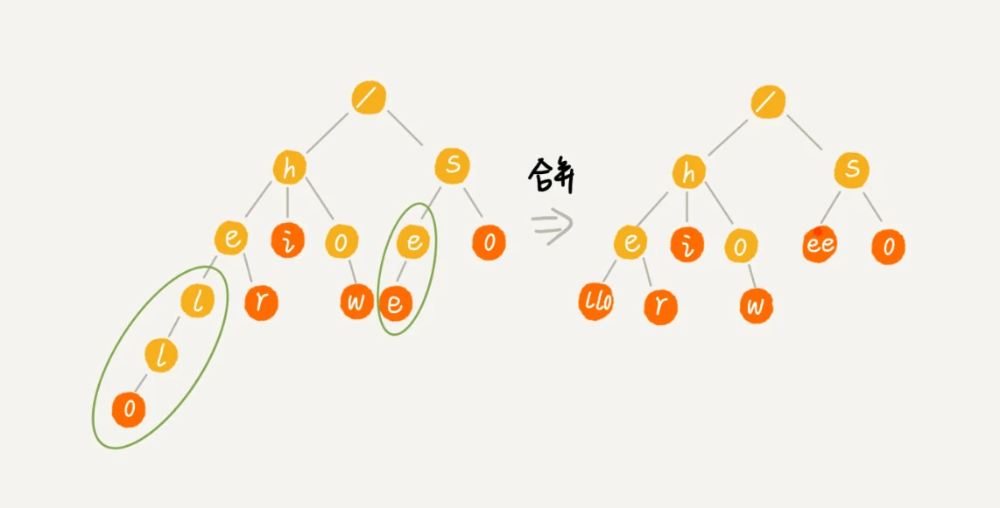

---

### **(3) 使用双数组 Trie（Double-Array Trie, DAT）**
- **去掉指针**，用数组模拟 Trie，减少指针存储占用。
- 应用于 **词典查询、文本搜索**，如 `OpenFST`。

---

## **3. Trie 树 vs 其他数据结构的内存消耗**
| 数据结构  | 内存占用 | 查询速度 | 适用场景 |
|----------|---------|---------|---------|
| **Trie** | 高（O(N × A)）| 快（O(M)） | 适合前缀匹配、大量短单词 |
| **哈希表** | 低（O(N)） | 快（O(1)） | 适合随机字符串存储，但无法高效做前缀查询 |
| **压缩 Trie** | 低（O(N)） | 较快（O(M)） | 适合存储路由/IP 地址 |
| **B+ 树** | 适中（O(N log N)）| O(log N) | 适用于数据库索引 |

**总结**
- **Trie 适用于前缀匹配、高效查找，但内存占用较高**。
- **可以通过哈希表、压缩 Trie、双数组 Trie 等优化内存**。

---

### **4. 结论**
- **Trie 树确实耗内存**，因为每个节点通常存储 **指针数组**（占用 O(A)）。
- **优化方法**：
   - **哈希表代替固定大小数组**，减少指针浪费。
   - **使用压缩 Trie（Radix Trie）**，合并单链路径。
   - **使用双数组 Trie（DAT）**，去掉指针存储。

🚀 **如果需要存储大量短单词，Trie 是一个强大但占内存的数据结构，建议结合优化方法减少存储开销！**


