# 树

重要概念

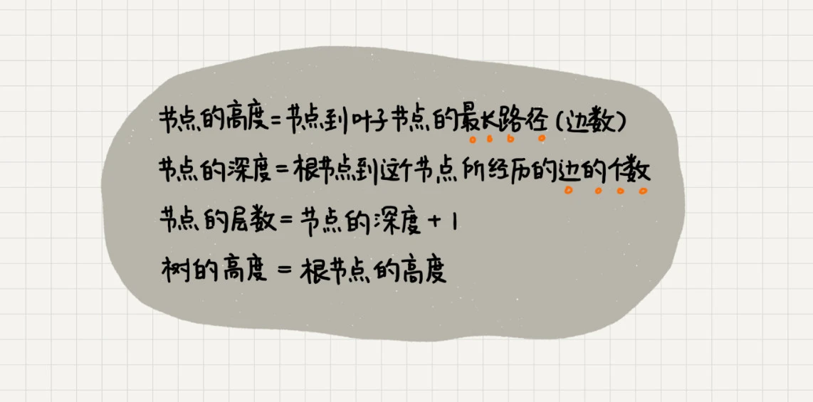

示意图

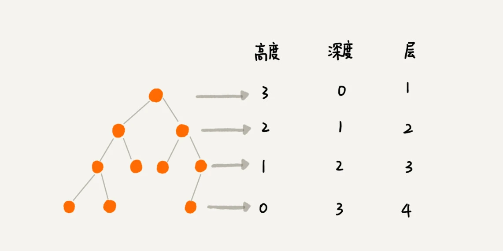

## 二叉树

### 二叉树与常见二叉树

二叉树，顾名思义，每个节点最多有两个“叉”，也就是两个子节点，分别是左子节点和右子节点。不过，二叉树并不要求每个节点都有两个子节点，有的节点只有左子节点，有的节点只有右子节点。我画的这几个都是二叉树。以此类推，你可以想象一下四叉树、八叉树长什么样子

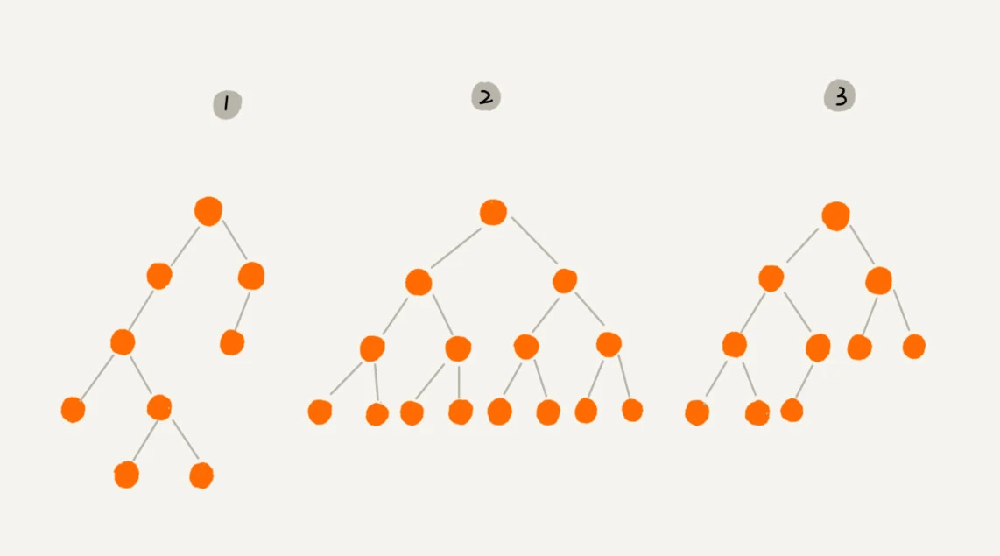

这个图里面，有两个比较特殊的二叉树，分别是编号 2 和编号 3 这两个

其中，编号 2 的二叉树中，叶子节点全都在最底层，除了叶子节点之外，每个节点都有左右两个子节点，这种二叉树就叫做满二叉树。

编号 3 的二叉树中，叶子节点都在最底下两层，最后一层的叶子节点都靠左排列，并且除了最后一层，其他层的节点个数都要达到最大，这种二叉树叫做完全二叉树。

满二叉树很好理解，也很好识别，但是完全二叉树，有的人可能就分不清了。我画了几个完全二叉树和非完全二叉树的例子，你可以对比着看看。

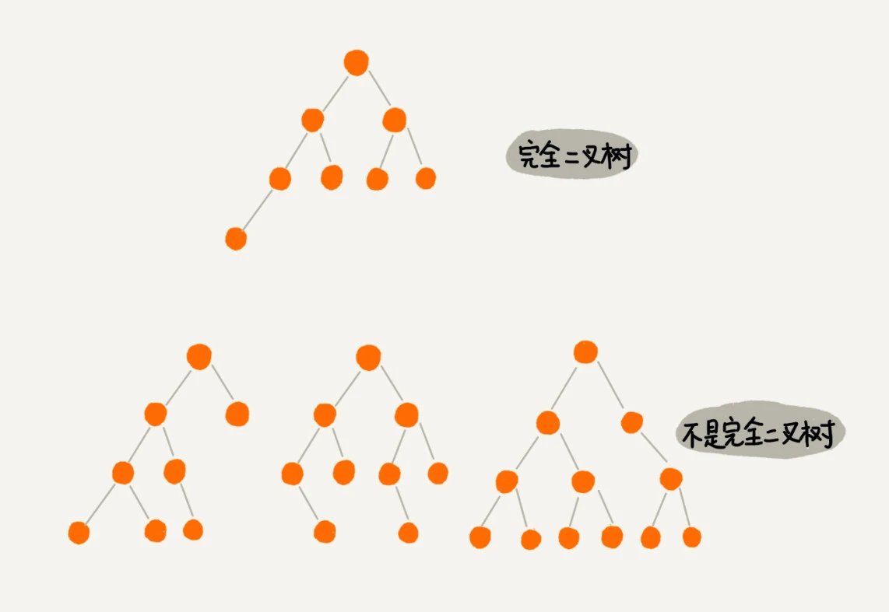


想要存储一棵二叉树，我们有两种方法，一种是基于指针或者引用的二叉链式存储法，一种是基于数组的顺序存储法。

**链式存储法**

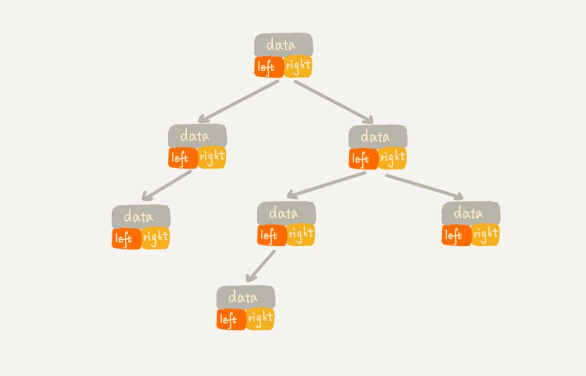

从图中你应该可以很清楚地看到，每个节点有三个字段，其中一个存储数据，另外两个是指向左右子节点的指针。我们只要拎住根节点，就可以通过左右子节点的指针，把整棵树都串起来。这种存储方式我们比较常用。大部分二叉树代码都是通过这种结构来实现的

**顺序存储法**

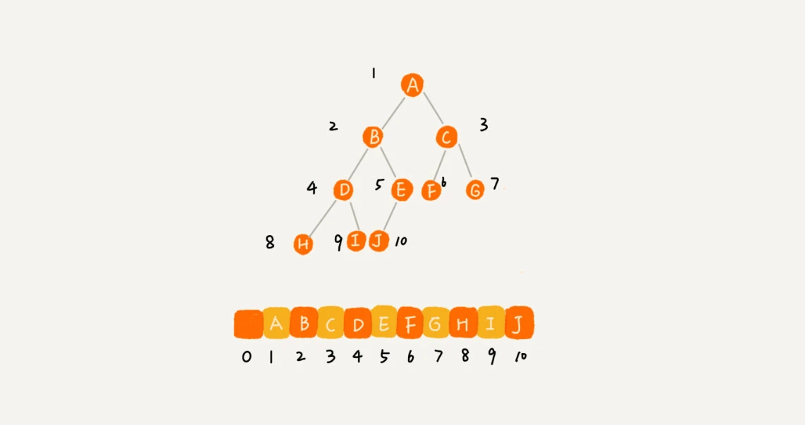

我们再来看，基于数组的**顺序存储法**。我们把根节点存储在下标 i = 1 的位置，那左子节点存储在下标 2 * i = 2 的位置，右子节点存储在
2 * i + 1 = 3 的位置。以此类推，B 节点的左子节点存储在 2 * i = 2 * 2 = 4 的位置，右子节点存储在 2 * i + 1 = 2 * 2 + 1 = 5
的位置。

我来总结一下，如果节点 X 存储在数组中下标为 i 的位置，下标为 2 * i 的位置存储的就是左子节点，下标为 2 * i + 1
的位置存储的就是右子节点。反过来，下标为 i/2 的位置存储就是它的父节点。通过这种方式，我们只要知道根节点存储的位置（一般情况下，为了方便计算子节点，根节点会存储在下标为
1 的位置），这样就可以通过下标计算，把整棵树都串起来

不过，我刚刚举的例子是一棵完全二叉树，所以仅仅“浪费”了一个下标为 0 的存储位置。如果是非完全二叉树，其实会浪费比较多的数组存储空间。你可以看我举的下面这个例子

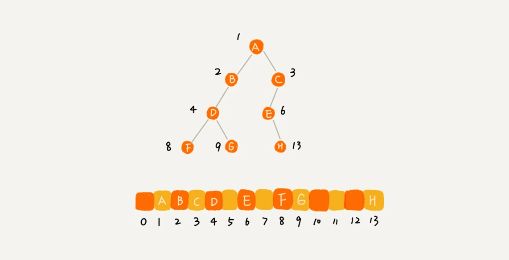

所以，如果某棵二叉树是一棵完全二叉树，那用数组存储无疑是最节省内存的一种方式。因为数组的存储方式并不需要像链式存储法那样，要存储额外的左右子节点的指针。这也是为什么完全二叉树会单独拎出来的原因，也是为什么完全二叉树要求最后一层的子节点都靠左的原因

当我们讲到堆和堆排序的时候，你会发现，堆其实就是一种完全二叉树，最常用的存储方式就是数组

### 二叉树的遍历

前面我讲了二叉树的基本定义和存储方法，现在我们来看二叉树中非常重要的操作，二叉树的遍历。这也是非常常见的面试题

如何将所有节点都遍历打印出来呢？经典的方法有三种**，前序遍历、中序遍历和后序遍历**。其中，前、中、后序，表示的是节点与它的左右子树节点遍历打印的先后顺序

- 前序遍历是指，对于树中的任意节点来说，先打印这个节点，然后再打印它的左子树，最后打印它的右子树。
- 中序遍历是指，对于树中的任意节点来说，先打印它的左子树，然后再打印它本身，最后打印它的右子树。
- 后序遍历是指，对于树中的任意节点来说，先打印它的左子树，然后再打印它的右子树，最后打印这个节点本身。

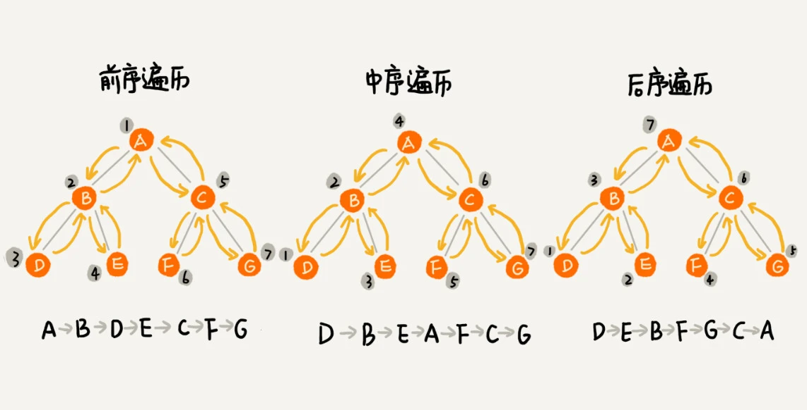

```text

前序遍历的递推公式：
preOrder(r) = print r->preOrder(r->left)->preOrder(r->right)

中序遍历的递推公式：
inOrder(r) = inOrder(r->left)->print r->inOrder(r->right)

后序遍历的递推公式：
postOrder(r) = postOrder(r->left)->postOrder(r->right)->print r
```

二叉树的前、中、后序遍历的递归实现是不是很简单？你知道二叉树遍历的时间复杂度是多少吗？我们一起来看看

从我前面画的前、中、后序遍历的顺序图，可以看出来，每个节点最多会被访问两次，所以遍历操作的时间复杂度，跟节点的个数 n
成正比，也就是说二叉树遍历的时间复杂度是 O(n)。

#### 思考题

1. 给定一组数据，比如 1，3，5，6，9，10。你来算算，可以构建出多少种不同的二叉树？
    2. 一共有n!种组合
2. 我们讲了三种二叉树的遍历方式，前、中、后序。实际上，还有另外一种遍历方式，也就是按层遍历，你知道如何实现吗？
    3. 通过层序遍历

## 二叉查找树

**定义**：二叉查找树要求，在树中的任意一个节点，其左子树中的每个节点的值，都要小于这个节点的值，而右子树节点的值都大于这个节点的值

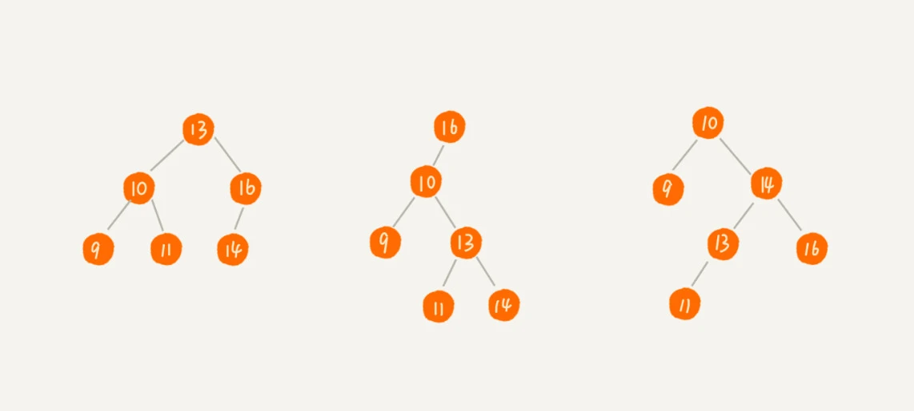

### 1.二叉查找树的查找操作

首先，我们看如何在二叉查找树中查找一个节点。我们先取根节点，如果它等于我们要查找的数据，那就返回。如果要查找的数据比根节点的值小，那就在左子树中递归查找；如果要查找的数据比根节点的值大，那就在右子树中递归查找

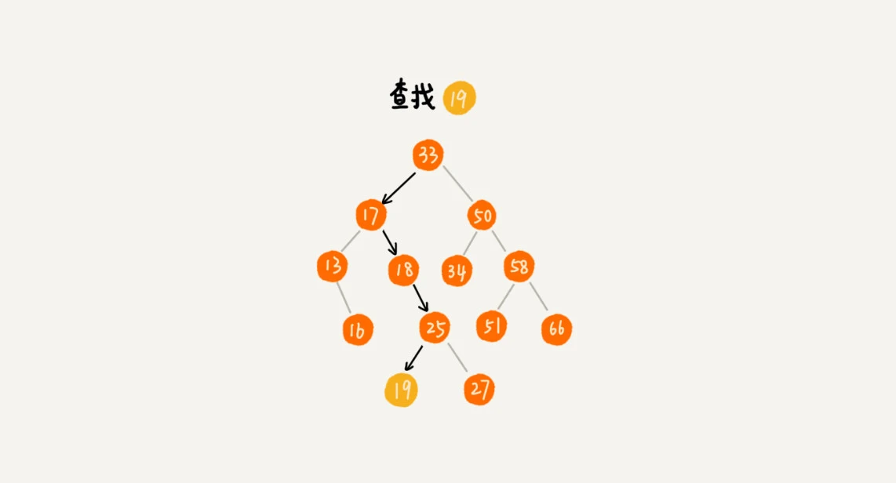

```java
public class BinarySearchTree {
  private Node tree;

  public Node find(int data) {
    Node p = tree;
    while (p != null) {
      if (data < p.data) p = p.left;
      else if (data > p.data) p = p.right;
      else return p;
    }
    return null;
  }

  public static class Node {
    private int data;
    private Node left;
    private Node right;

    public Node(int data) {
      this.data = data;
    }
  }
}
```

### 2.二叉查找树的插入操作

二叉查找树的插入过程有点类似查找操作。新插入的数据一般都是在叶子节点上，所以我们只需要从根节点开始，依次比较要插入的数据和节点的大小关系。

如果要插入的数据比节点的数据大，并且节点的右子树为空，就将新数据直接插到右子节点的位置；如果不为空，就再递归遍历右子树，查找插入位置。同理，如果要插入的数据比节点数值小，并且节点的左子树为空，就将新数据插入到左子节点的位置；如果不为空，就再递归遍历左子树，查找插入位置。

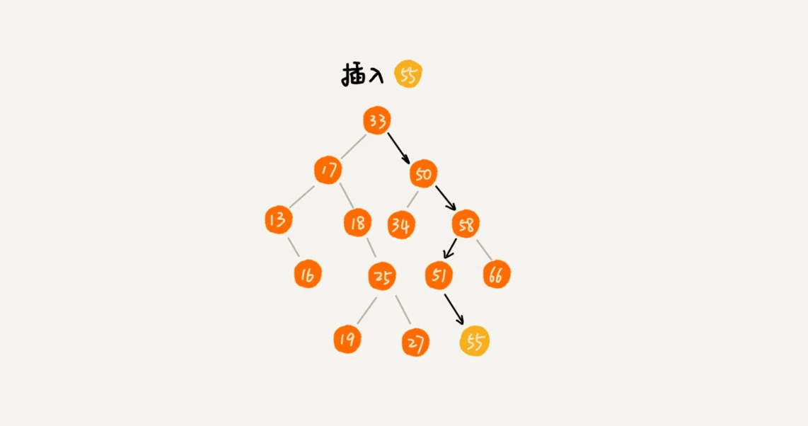

```java
public void insert(int data) {
  if (tree == null) {
    tree = new Node(data);
    return;
  }

  Node p = tree;
  while (p != null) {
    if (data > p.data) {
      if (p.right == null) {
        p.right = new Node(data);
        return;
      }
      p = p.right;
    } else { // data < p.data
      if (p.left == null) {
        p.left = new Node(data);
        return;
      }
      p = p.left;
    }
  }
}
```

### 3.二叉查找树的删除操作

二叉查找树的查找、插入操作都比较简单易懂，但是它的删除操作就比较复杂了 。针对要删除节点的子节点个数的不同，我们需要分三种情况来处理。

1. 第一种情况是，如果要删除的节点没有子节点，我们只需要直接将父节点中，指向要删除节点的指针置为 null。比如图中的删除节点 55。
2. 第二种情况是，如果要删除的节点只有一个子节点（只有左子节点或者右子节点），我们只需要更新父节点中，指向要删除节点的指针，让它指向要删除节点的子节点就可以了。比如图中的删除节点 13。
3. 第三种情况是，如果要删除的节点有两个子节点，这就比较复杂了。我们需要找到这个节点的右子树中的最小节点，把它替换到要删除的节点上。然后再删除掉这个最小节点，因为最小节点肯定没有左子节点（如果有左子结点，那就不是最小节点了），所以，我们可以应用上面两条规则来删除这个最小节点。比如图中的删除节点 18。

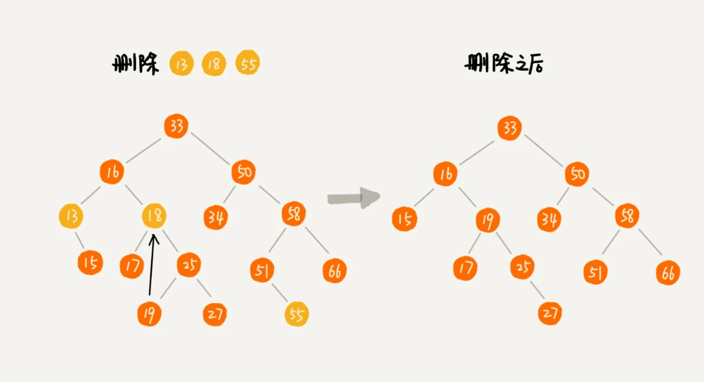

```java
public void delete(int data) {
  Node p = tree; // p指向要删除的节点，初始化指向根节点
  Node pp = null; // pp记录的是p的父节点
  while (p != null && p.data != data) {
    pp = p;
    if (data > p.data) p = p.right;
    else p = p.left;
  }
  if (p == null) return; // 没有找到

  // 要删除的节点有两个子节点
  if (p.left != null && p.right != null) { // 查找右子树中最小节点
    Node minP = p.right;
    Node minPP = p; // minPP表示minP的父节点
    while (minP.left != null) {
      minPP = minP;
      minP = minP.left;
    }
    p.data = minP.data; // 将minP的数据替换到p中
    p = minP; // 下面就变成了删除minP了
    pp = minPP;
  }

  // 删除节点是叶子节点或者仅有一个子节点
  Node child; // p的子节点
  if (p.left != null) child = p.left;
  else if (p.right != null) child = p.right;
  else child = null;

  if (pp == null) tree = child; // 删除的是根节点
  else if (pp.left == p) pp.left = child;
  else pp.right = child;
}
```

实际上，关于二叉查找树的删除操作，还有个非常简单、取巧的方法，就是单纯将要删除的节点标记为“已删除”，但是并不真正从树中将这个节点去掉。这样原本删除的节点还需要存储在内存中，比较浪费内存空间，但是删除操作就变得简单了很多。而且，这种处理方法也并没有增加插入、查找操作代码实现的难度。

### 4.二叉查找树的其他操作

- 除了插入、删除、查找操作之外，二叉查找树中还可以支持快速地查找最大节点和最小节点、前驱节点和后继节点
- 二叉查找树除了支持上面几个操作之外，还有一个重要的特性，就是中序遍历二叉查找树，可以输出有序的数据序列，时间复杂度是 O(n)
  ，非常高效

## 支持重复数据的二叉查找树

第一种方式

第一种方法比较容易。二叉查找树中每一个节点不仅会存储一个数据，因此我们通过链表和支持动态扩容的数组等数据结构，把值相同的数据都存储在同一个节点上

第二种方式

每个节点仍然只存储一个数据。在查找插入位置的过程中，如果碰到一个节点的值，与要插入数据的值相同，我们就将这个要插入的数据放到这个节点的右子树，也就是说，把这个新插入的数据当作大于这个节点的值来处理。

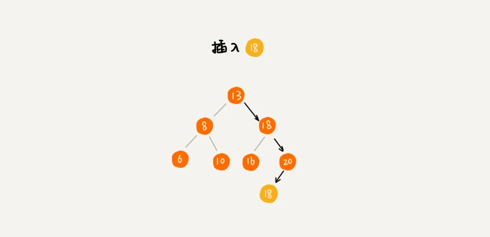

### 二叉查找树的时间复杂度

不管操作是插入、删除还是查找，时间复杂度其实都跟树的高度成正比，也就是 O(height)，既然这样，现在问题就转变成另外一个了，也就是，如何求一棵包含
n 个节点的完全二叉树的高度

**思考题:**
我们在散列表那节中讲过，散列表的插入、删除、查找操作的时间复杂度可以做到常量级的 O(1)
，非常高效。而二叉查找树在比较平衡的情况下，插入、删除、查找操作时间复杂度才是 O(logn)，相对散列表，好像并没有什么优势，那我们为什么还要用二叉查找树呢？

第一，散列表中的数据是无序存储的，如果要输出有序的数据，需要先进行排序。而对于二叉查找树来说，我们只需要中序遍历，就可以在 O(
n) 的时间复杂度内，输出有序的数据序列。

第二，散列表扩容耗时很多，而且当遇到散列冲突时，性能不稳定，尽管二叉查找树的性能不稳定，但是在工程中，我们最常用的平衡二叉查找树的性能非常稳定，时间复杂度稳定在
O(logn)。

第三，笼统地来说，尽管散列表的查找等操作的时间复杂度是常量级的，但因为哈希冲突的存在，这个常量不一定比 logn
小，所以实际的查找速度可能不一定比 O(logn) 快。加上哈希函数的耗时，也不一定就比平衡二叉查找树的效率高。

第四，散列表的构造比二叉查找树要复杂，需要考虑的东西很多。比如散列函数的设计、冲突解决办法、扩容、缩容等。平衡二叉查找树只需要考虑平衡性这一个问题，而且这个问题的解决方案比较成熟、固定。

最后，为了避免过多的散列冲突，散列表装载因子不能太大，特别是基于开放寻址法解决冲突的散列表，不然会浪费一定的存储空间。

## 红黑树

### 红黑树的定义

红黑树的英文是“Red-Black Tree”，简称 R-B Tree。它是一种不严格的平衡二叉查找树

顾名思义，红黑树中的节点，一类被标记为黑色，一类被标记为红色。除此之外，一棵红黑树还需要满足这样几个要求

- 根节点是黑色的；
- 每个叶子节点都是黑色的空节点（NIL），也就是说，叶子节点不存储数据；
- 任何相邻的节点都不能同时为红色，也就是说，红色节点是被黑色节点隔开的；
- 每个节点，从该节点到达其可达叶子节点的所有路径，都包含相同数目的黑色节点；

这里的第二点要求“叶子节点都是黑色的空节点”，稍微有些奇怪，它主要是为了简化红黑树的代码实现而设置的，我们讲红黑树的实现的时候会讲到。

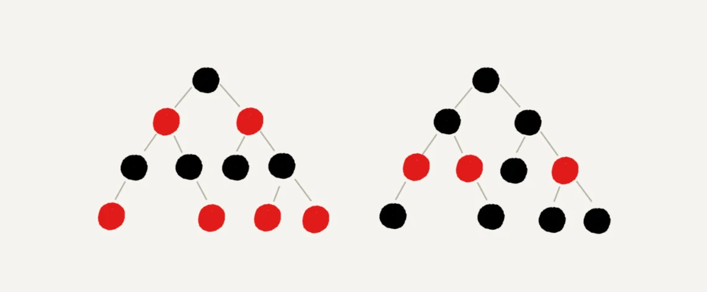

红黑树的操作关键：**左旋与右旋**

左旋（rotate left）、右旋（rotate right）。左旋全称其实是叫围绕某个节点的左旋，那右旋的全称估计你已经猜到了，就叫围绕某个节点的右旋


### 插入操作的平衡处理

红黑树规定，插入的节点必须是红色的。而且，二叉查找树中新插入的节点都是放在叶子节点上。所以，关于插入操作的平衡调整，有这样两种特殊情况，但是也都非常好处理

- 如果插入节点的父节点是黑色的，那我们什么都不用做，它仍然满足红黑树的定义。
- 如果插入的节点是根节点，那我们直接改变它的颜色，把它变成黑色就可以了。

除此之外，其他情况都会违背红黑树的定义，于是我们就需要进行调整，调整的过程包含两种基础的操作：左右旋转和改变颜色。

红黑树的平衡调整过程是一个迭代的过程。我们把正在处理的节点叫做关注节点。关注节点会随着不停地迭代处理，而不断发生变化。最开始的关注节点就是新插入的节点。

新节点插入之后，如果红黑树的平衡被打破，那一般会有下面三种情况。我们只需要根据每种情况的特点，不停地调整，就可以让红黑树继续符合定义，也就是继续保持平衡。

#### CASE 1：如果关注节点是 a，它的叔叔节点 d 是红色，我们就依次执行下面的操作：

1. 将关注节点 a 的父节点 b、叔叔节点 d 的颜色都设置成黑色；
2. 将关注节点 a 的祖父节点 c 的颜色设置成红色；
3. 关注节点变成 a 的祖父节点 c；
4. 跳到 CASE 2 或者 CASE 3。


#### CASE 2：如果关注节点是 a，它的叔叔节点 d 是黑色，关注节点 a 是其父节点 b 的右子节点，我们就依次执行下面的操作：

1. 关注节点变成节点 a 的父节点 b；
2. 围绕新的关注节点 b 左旋；
3. 跳到 CASE 3。

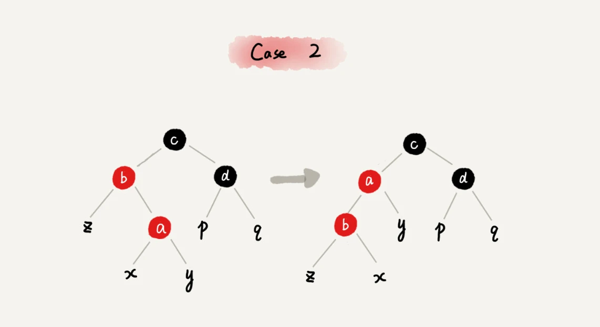

#### CASE 3：如果关注节点是 a，它的叔叔节点 d 是黑色，关注节点 a 是其父节点 b 的左子节点，我们就依次执行下面的操作

1. 围绕关注节点 a 的祖父节点 c 右旋；
2. 将关注节点 a 的父节点 b、兄弟节点 c 的颜色互换。
3. 调整结束。

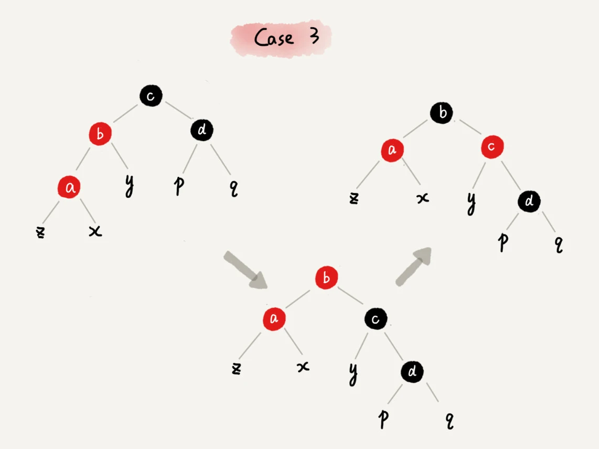

### 删除操作的平衡处理

#### 1. 针对删除节点的初步调整

这里需要注意一下，红黑树的定义中“只包含红色节点和黑色节点”，经过初步调整之后，为了保证满足红黑树定义的最后一条要求，有些节点会被标记成两种颜色，“红 -
黑”或者“黑 - 黑”。如果一个节点被标记为了“黑 - 黑”，那在计算黑色节点个数的时候，要算成两个黑色节点。

在下面的讲解中，如果一个节点既可以是红色，也可以是黑色，在画图的时候，我会用一半红色一半黑色来表示。如果一个节点是“红 -
黑”或者“黑 - 黑”，我会用左上角的一个小黑点来表示额外的黑色

#### CASE1: 如果要删除的节点是 a，它只有一个子节点 b，那我们就依次进行下面的操作

1. 如果要删除的节点是 a，它只有一个子节点 b，那我们就依次进行下面的操作
2. 节点 a 只能是黑色，节点 b 也只能是红色，其他情况均不符合红黑树的定义。这种情况下，我们把节点 b 改为黑色；
3. 调整结束，不需要进行二次调整。

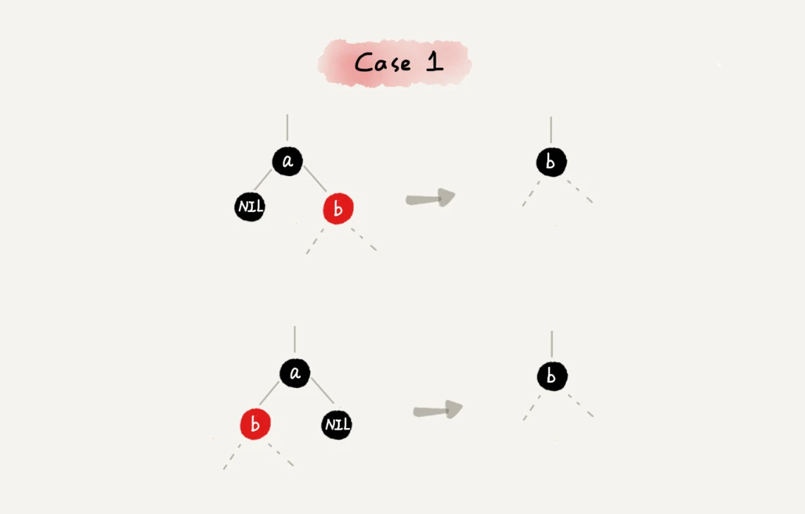

#### CASE2: 如果要删除的节点 a 有两个非空子节点，并且它的后继节点就是节点 a 的右子节点 c。我们就依次进行下面的操作

1. 如果节点 a 的后继节点就是右子节点 c，那右子节点 c 肯定没有左子树。我们把节点 a 删除，并且将节点 c 替换到节点 a
   的位置。这一部分操作跟普通的二叉查找树的删除操作无异；
2. 然后把节点 c 的颜色设置为跟节点 a 相同的颜色；
3. 如果节点 c 是黑色，为了不违反红黑树的最后一条定义，我们给节点 c 的右子节点 d 多加一个黑色，这个时候节点 d 就成了“红 - 黑”或者“黑 - 黑”；
4. 这个时候，关注节点变成了节点 d，第二步的调整操作就会针对关注节点来做。

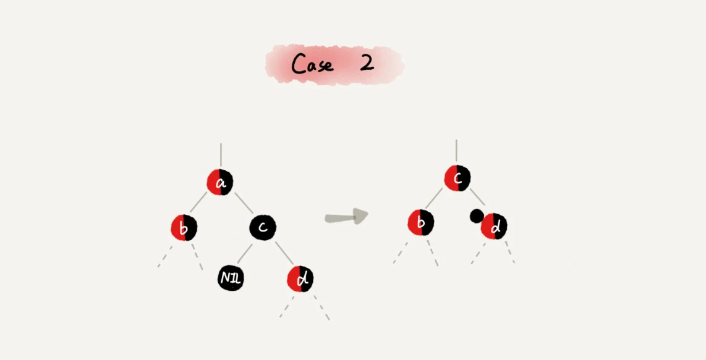

#### CASE3: 如果要删除的是节点 a，它有两个非空子节点，并且节点 a 的后继节点不是右子节点，我们就依次进行下面的操作

1. 找到后继节点 d，并将它删除，删除后继节点 d 的过程参照 CASE 1；
2. 将节点 a 替换成后继节点 d；
3. 把节点 d 的颜色设置为跟节点 a 相同的颜色；
4. 如果节点 d 是黑色，为了不违反红黑树的最后一条定义，我们给节点 d 的右子节点 c 多加一个黑色，这个时候节点 c 就成了“红 -
   黑”或者“黑 - 黑”；
5. 这个时候，关注节点变成了节点 c，第二步的调整操作就会针对关注节点来做。

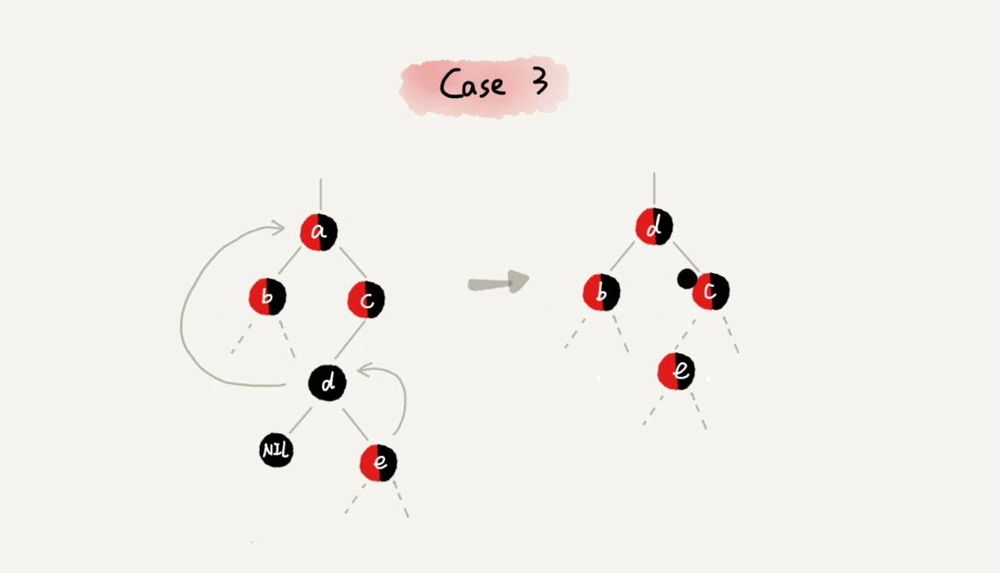

#### 2. 针对关注节点进行二次调整

经过初步调整之后，关注节点变成了“红 - 黑”或者“黑 - 黑”节点。针对这个关注节点，我们再分四种情况来进行二次调整。二次调整是为了让红黑树中不存在相邻的红色节点。

#### CASE 1：如果关注节点是 a，它的兄弟节点 c 是红色的

1. 围绕关注节点 a 的父节点 b 左旋；
2. 关注节点 a 的父节点 b 和祖父节点 c 交换颜色；
3. 关注节点不变；
4. 继续从四种情况中选择适合的规则来调整。

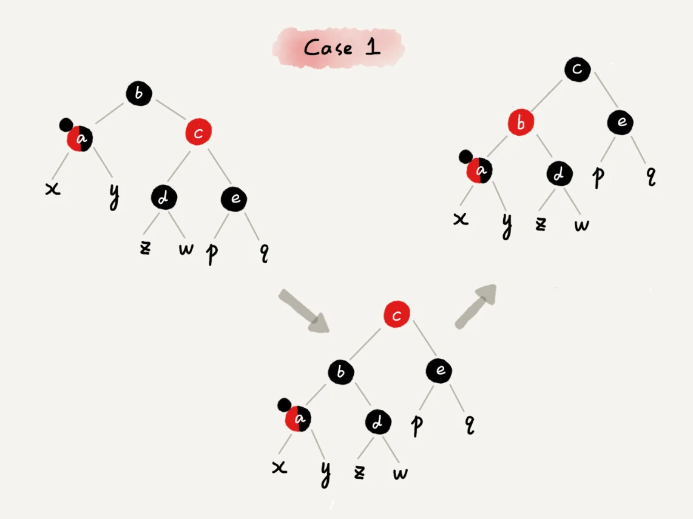

#### CASE 2：如果关注节点是 a，它的兄弟节点 c 是黑色的，并且节点 c 的左右子节点 d、e 都是黑色的，我们就依次进行下面的操作：

1. 将关注节点 a 的兄弟节点 c 的颜色变成红色；
2. 从关注节点 a 中去掉一个黑色，这个时候节点 a 就是单纯的红色或者黑色；
3. 给关注节点 a 的父节点 b 添加一个黑色，这个时候节点 b 就变成了“红 - 黑”或者“黑 - 黑”；关注节点从 a 变成其父节点 b；
4. 继续从四种情况中选择符合的规则来调整。

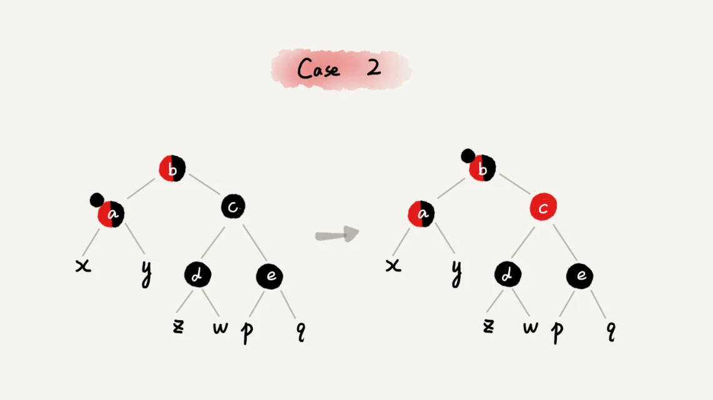

#### CASE 3：如果关注节点是 a，它的兄弟节点 c 是黑色，c 的左子节点 d 是红色，c 的右子节点 e 是黑色，我们就依次进行下面的操作

1. 围绕关注节点 a 的兄弟节点 c 右旋；
2. 节点 c 和节点 d 交换颜色；
3. 关注节点不变；
4. 跳转到 CASE 4，继续调整。

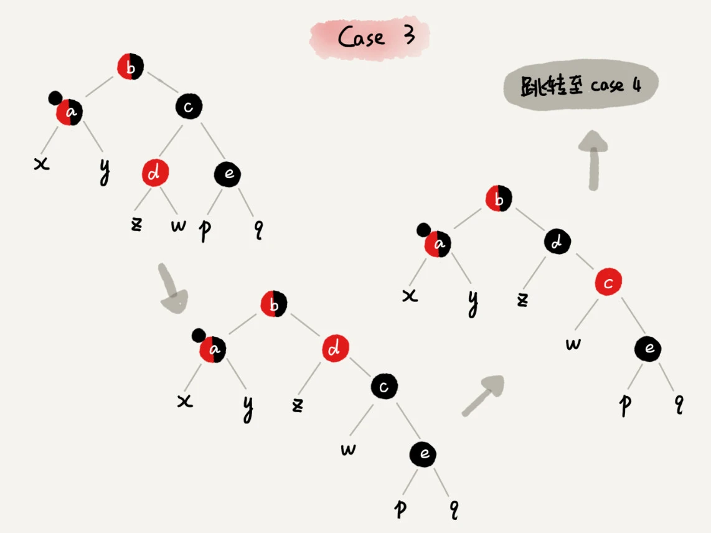

#### CASE 4：如果关注节点 a 的兄弟节点 c 是黑色的，并且 c 的右子节点是红色的，我们就依次进行下面的操作

1. 围绕关注节点 a 的父节点 b 左旋；
2. 将关注节点 a 的兄弟节点 c 的颜色，跟关注节点 a 的父节点 b 设置成相同的颜色；
3. 将关注节点 a 的父节点 b 的颜色设置为黑色；从关注节点 a 中去掉一个黑色，节点 a 就变成了单纯的红色或者黑色；
4. 将关注节点 a 的叔叔节点 e 设置为黑色；
5. 调整结束。

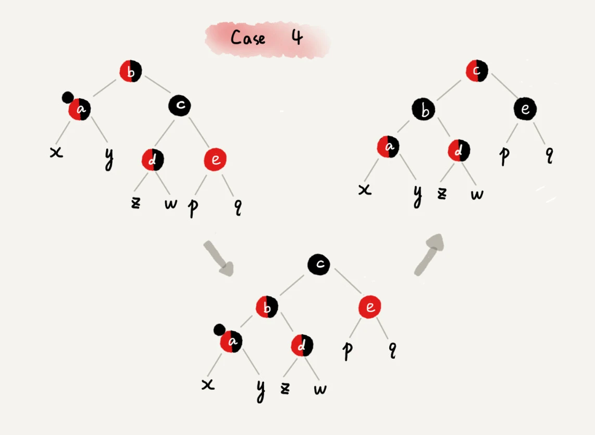

## 堆和堆排序

完全二叉树比较适合用数组来存储。用数组来存储完全二叉树是非常节省存储空间的。因为我们不需要存储左右子节点的指针，单纯地通过数组的下标，就可以找到一个节点的左右子节点和父节点。

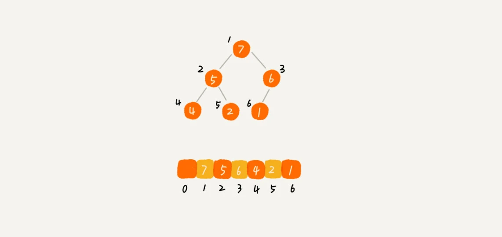

从图中我们可以看到，数组中下标为 i 的节点的左子节点，就是下标为 i∗2 的节点，右子节点就是下标为 i∗2+1 的节点，父节点就是下标为 2/i 的节点。

### 1. 往堆中插入一个元素

堆化实际上有两种，从下往上和从上往下。这里我先讲从下往上的堆化方法

#### 从下往上堆化

堆化非常简单，就是顺着节点所在的路径，向上或者向下，对比，然后交换。

我这里画了一张堆化的过程分解图。我们可以让新插入的节点与父节点对比大小。如果不满足子节点小于等于父节点的大小关系，我们就互换两个节点。一直重复这个过程，直到父子节点之间满足刚说的那种大小关系

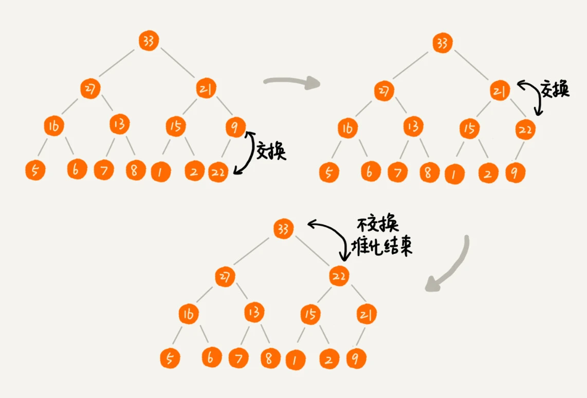


### 2. 从堆中删除一个元素

实际上，我们稍微改变一下思路，就可以解决这个问题。你看我画的下面这幅图。我们把最后一个节点放到堆顶，然后利用同样的父子节点对比方法。对于不满足父子节点大小关系的，互换两个节点，并且重复进行这个过程，直到父子节点之间满足大小关系为止。这就是从上往下的堆化方法。

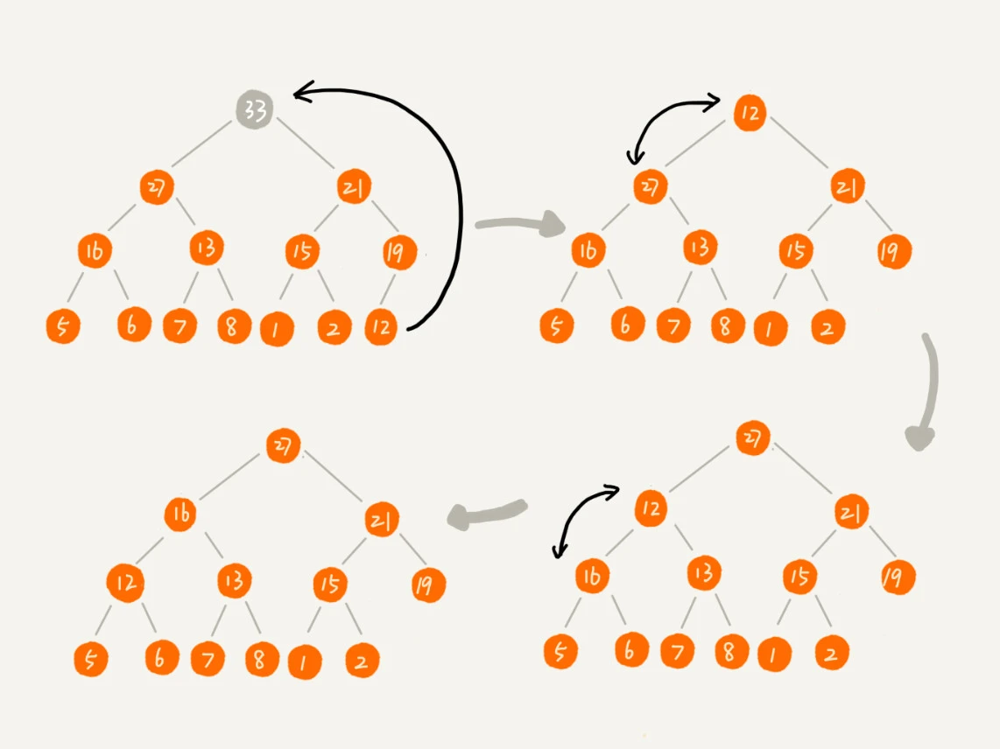

我们知道，一个包含 n 个节点的完全二叉树，树的高度不会超过 log2​n。堆化的过程是顺着节点所在路径比较交换的，所以堆化的时间复杂度跟树的高度成正比，也就是
O(logn)。插入数据和删除堆顶元素的主要逻辑就是堆化，所以，往堆中插入一个元素和删除堆顶元素的时间复杂度都是 O(logn)。

### 3. 实现堆排序

可以把堆排序的过程大致分解成两个大的步骤，**建堆**和**排序**。


### 堆排序为什么没有快速排序性能好？

#### 第一点，堆排序数据访问的方式没有快速排序友好

对于快速排序来说，数据是顺序访问的。而对于堆排序来说，数据是跳着访问的。
比如，堆排序中，最重要的一个操作就是数据的堆化。比如下面这个例子，对堆顶节点进行堆化，会依次访问数组下标是 1，2，4，8
的元素，而不是像快速排序那样，局部顺序访问，所以，这样对 CPU 缓存是不友好的

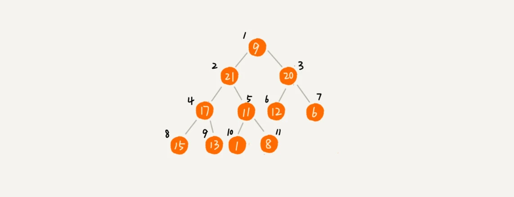

#### 第二点，对于同样的数据，在排序过程中，堆排序算法的数据交换次数要多于快速排序

排序的时候，提过两个概念，有序度和逆序度。对于基于比较的排序算法来说，整个排序过程就是由两个基本的操作组成的，比较和交换（或移动）。快速排序数据交换的次数不会比逆序度多

但是堆排序的第一步是建堆，建堆的过程会打乱数据原有的相对先后顺序，导致原数据的有序度降低。比如，对于一组已经有序的数据来说，经过建堆之后，数据反而变得更无序了

---

## 堆的应用

### 应用1: 优先级队列

优先级队列，顾名思义，它首先应该是一个队列。我们前面讲过，队列最大的特性就是先进先出。不过，在优先级队列中，数据的出队顺序不是先进先出，而是按照优先级来，优先级最高的，最先出队

如何实现一个优先级队列呢？方法有很多，但是用堆来实现是最直接、最高效的。这是因为，堆和优先级队列非常相似。一个堆就可以看作一个优先级队列。很多时候，它们只是概念上的区分而已。往优先级队列中插入一个元素，就相当于往堆中插入一个元素；从优先级队列中取出优先级最高的元素，就相当于取出堆顶元素

你可别小看这个优先级队列，它的应用场景非常多。我们后面要讲的很多数据结构和算法都要依赖它。比如，赫夫曼编码、图的最短路径、最小生成树算法等等。不仅如此，很多语言中，都提供了优先级队列的实现，比如，Java
的 PriorityQueue，C++ 的 priority_queue 等。

#### 1. 合并有序小文件

假设我们有 100 个小文件，每个文件的大小是 100MB，每个文件中存储的都是有序的字符串。我们希望将这些 100 个小文件合并成一个有序的大文件。这里就会用到优先级队列

#### 2. 高性能定时器

假设我们有一个定时器，定时器中维护了很多定时任务，每个任务都设定了一个要触发执行的时间点。定时器每过一个很小的单位时间（比如 1 秒），就扫描一遍任务，看是否有任务到达设定的执行时间。如果到达了，就拿出来执行

### 应用2: 利用堆求 Top K

求 Top K 的问题抽象成两类。一类是针对静态数据集合，也就是说数据集合事先确定，不会再变。另一类是针对动态数据集合，也就是说数据集合事先并不确定，有数据动态地加入到集合中

针对静态数据，如何在一个包含 n 个数据的数组中，查找前 K 大数据呢？我们可以维护一个大小为 K
的小顶堆，顺序遍历数组，从数组中取出数据与堆顶元素比较。如果比堆顶元素大，我们就把堆顶元素删除，并且将这个元素插入到堆中；如果比堆顶元素小，则不做处理，继续遍历数组。这样等数组中的数据都遍历完之后，堆中的数据就是前
K 大数据了。

遍历数组需要 O(n) 的时间复杂度，一次堆化操作需要 O(logK) 的时间复杂度，所以最坏情况下，n 个元素都入堆一次，时间复杂度就是
O(nlogK)。

针对动态数据求得 Top K 就是实时 Top K。怎么理解呢？我举一个例子。一个数据集合中有两个操作，一个是添加数据，另一个询问当前的前
K 大数据。

如果每次询问前 K 大数据，我们都基于当前的数据重新计算的话，那时间复杂度就是 O(nlogK)，n 表示当前的数据的大小。实际上，我们可以一直都维护一个
K 大小的小顶堆，当有数据被添加到集合中时，我们就拿它与堆顶的元素对比。如果比堆顶元素大，我们就把堆顶元素删除，并且将这个元素插入到堆中；如果比堆顶元素小，则不做处理。这样，无论任何时候需要查询当前的前
K 大数据，我们都可以立刻返回给他。

### 应用3: 利用堆求动态数据中位数

我们需要维护两个堆，一个大顶堆，一个小顶堆。大顶堆中存储前半部分数据，小顶堆中存储后半部分数据，且小顶堆中的数据都大于大顶堆中的数据。

也就是说，如果有 n 个数据，n 是偶数，我们从小到大排序，那前n/2个数据存储在大顶堆中，后 n/2
个数据存储在小顶堆中。这样，大顶堆中的堆顶元素就是我们要找的中位数。如果 n 是奇数，情况是类似的，大顶堆就存储 n/2+1
个数据，小顶堆中就存储n/2个数据。


我们前面也提到，数据是动态变化的，当新添加一个数据的时候，我们如何调整两个堆，让大顶堆中的堆顶元素继续是中位数呢？

如果新加入的数据小于等于大顶堆的堆顶元素，我们就将这个新数据插入到大顶堆；否则，我们就将这个新数据插入到小顶堆。

这个时候就有可能出现，两个堆中的数据个数不符合前面约定的情况：如果 n 是偶数，两个堆中的数据个数都是n/2; n是奇数， 大顶堆有n/2 + 1;这个时候，我们可以从一个堆中不停地将堆顶元素移动到另一个堆，通过这样的调整，来让两个堆中的数据满足上面的约定

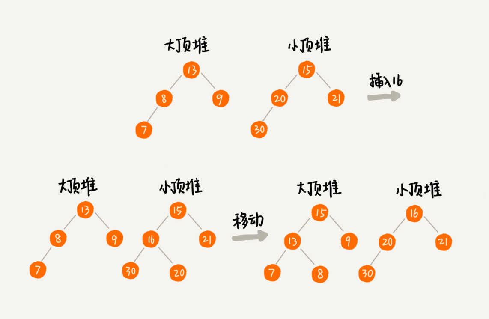

于是，我们就可以利用两个堆，一个大顶堆、一个小顶堆，实现在动态数据集合中求中位数的操作。插入数据因为需要涉及堆化，所以时间复杂度变成了 O(logn)，但是求中位数我们只需要返回大顶堆的堆顶元素就可以了，所以时间复杂度就是 O(1)

**思考题**

有一个访问量非常大的新闻网站，我们希望将点击量排名 Top 10 的新闻摘要，滚动显示在网站首页 banner 上，并且每隔 1
小时更新一次。如果你是负责开发这个功能的工程师，你会如何来实现呢？
